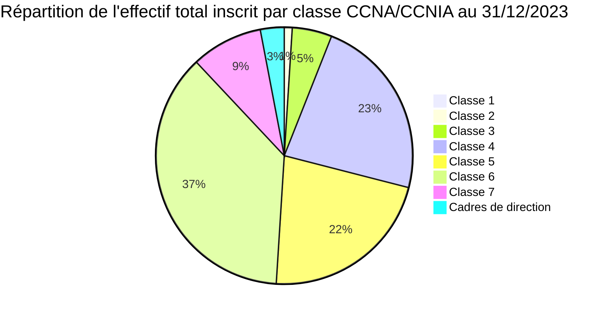
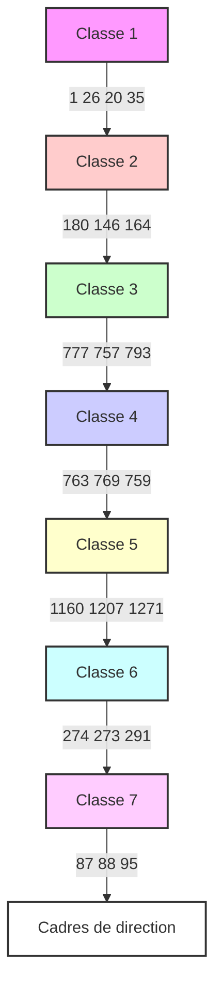
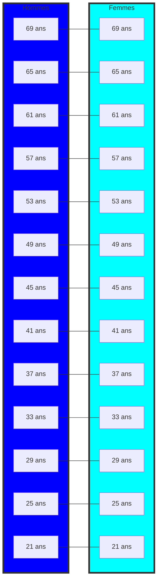
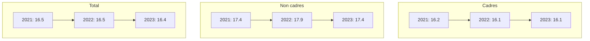
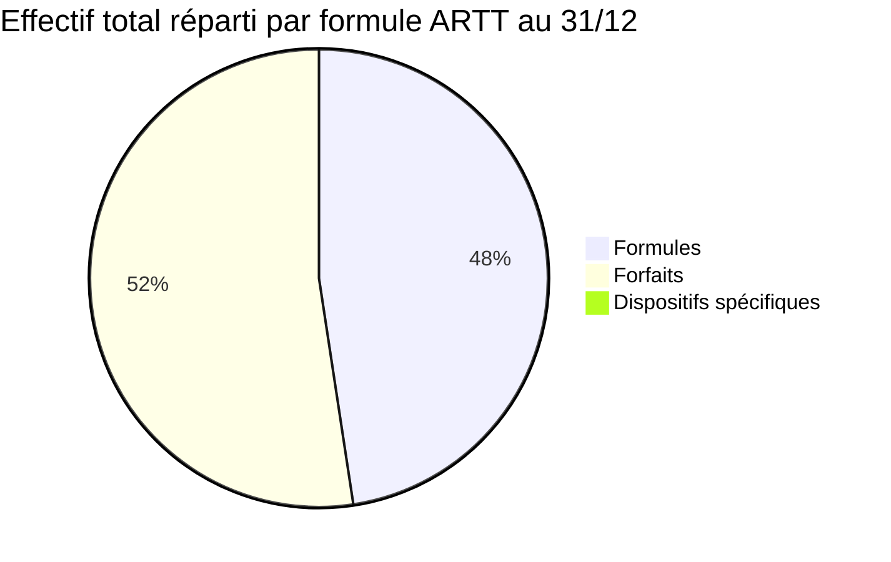

CNP Assurances logo

**Assurons un monde plus ouvert**

# Bilan social 2023

The image shows a woman with long curly hair, smiling brightly at the camera. She is wearing a dark green blouse with a white floral pattern. The background suggests an office setting with natural light coming through windows. 

In the top left corner, there's the CNP Assurances logo along with their slogan "Assurons un monde plus ouvert" (Let's ensure a more open world).

The main text on the image, highlighted in a teal color, reads:

**Bilan social**
**2023**

This appears to be the cover or title page for CNP Assurances' 2023 Social Report.
---
# Indicateurs clés de CNP Assurances

## Emploi P.4

| Indicateur | Valeur |
|------------|--------|
| Collaborateurs (effectif total) | 3 436 |
| de cadres | 70,4 % |
| d'effectif en alternance | 4,9 % |
| Entrées (hors alternance) | 252 |

## Rémunérations et charges P.34

| Indicateur | Valeur |
|------------|--------|
| Rémunération moyenne brute annuelle | 72 455 € |

## Santé et sécurité au travail P.46

| Indicateur | Valeur |
|------------|--------|
| Dépenses en matière de sécurité | 8 940 330 € |

BILAN SOCIAL 2023 - CNP ASSURANCES      2
---
## Autres conditions de travail P.50

12,2 % de l'effectif total travaille à temps partiel choisi

## Formation P.56

100 % des salariés ont suivi au moins une formation

26 h de formation en moyenne par an par collaborateur

## Relations professionnelles P.62

10 accords signés avec les représentants du personnel

54 réunions avec les représentants du personnel

## Autres conditions de vie P.66

Taux de subvention au Comité Social et Economique

1,75 % de la masse salariale brute

BILAN SOCIAL 2023 - CNP ASSURANCES                                             3
---
# I. Emploi

Employeur responsable, CNP Assurances vise à maintenir l'employabilité de tous.

- Un pilotage rapproché de l'effectif,

- Des embauches en CDI ciblées sur les besoins d'expertises nouvelles, notamment en remplacement de départs à la retraite, et dans une optique de rajeunissement de la pyramide des âges.

- Une politique d'alternance sur la durée qui porte l'engagement de CNP Assurances en matière d'insertion professionnelle des jeunes.

| Statistique | Valeur |
|-------------|--------|
| Collaborateurs | 3 436 |
| dont contrats d'alternance | 168 |
| Salariés en situation de handicap | 254 (+23 par rapport à 2022) |
| Salariés cadres | 70,4% (-0.7 pts par rapport à 2022) |
| Collaborateurs en CDD | 1,9% |
| Âge moyen | 46 ans |
| Ancienneté moyenne | 16,2 ans |
| Recrutements | 378 |
| dont salariés de moins de 25 ans (CDI et CDD y compris alternance) | 157 |
| Taux d'absentéisme | 5,3% |

The image also shows a professional woman in business attire standing by a window and speaking on a mobile phone, which visually represents the modern workforce described in the statistics.
---
# I.1 - Effectifs

L'effectif total inscrit de CNP Assurances au 31/12/2023, 3436 collaborateurs (y compris 168 contrats en alternance), est en augmentation (+4,4%) par rapport au 31/12/2022 en lien notamment avec l'intégration des 66 collaborateurs de MFP au 31 décembre et l'évolution du nombre de contrats en alternance (+35%). A iso-périmètre, l'effectif évolue de 2,4%.

Le nombre de fonctionnaires mis à la disposition de CNP Assurances poursuit sa décroissance sur 2023 avec une diminution des effectifs de près de 16%.

La part relative des salariés cadres diminue en 2023 (-0,7 points).

Les 3178 salariés CDI de CNP Assurances se répartissent entre :

- la convention collective nationale des assurances (CCNA) : 2881 personnes, soit 91% de l'effectif salarié
- l'accord cadres de direction : 95 personnes, soit 3% de l'effectif salarié
- la convention collective nationale de l'inspection d'assurance (CCNIA) : 202 personnes, soit 6% de l'effectif salarié.

L'âge moyen du collaborateur CDI de CNP Assurances s'élève à 47,3 ans, pour une ancienneté moyenne dans le groupe de 16,3 ans.

74,6% de l'effectif travaillent sur le site d'Issy les Moulineaux, les autres collaborateurs se partagent entre les sites d'Angers (19,9%), les implantations régionales (5,4%) ou sont en affectation à l'international.
Au 31/12/2023, 13 salariés CNP Assurances sont en mobilité internationale au Brésil, à Chypre, en Italie, Espagne et Irlande.

Le taux de recours aux CDD (hors alternance) au 31/12/2023 est de 1,9%, en légère baisse par rapport à 2022 (-0,2 point).

La répartition par métiers montre la prépondérance de 5 familles professionnelles :

- Relation Client (23,8% de l'effectif),
- Système d'information (15,8%),
- Distribution & Développement Commercial (10,7%),
- Performance et Organisation (10,3%),
- Gestion et Maîtrise des Risques (8,3%).

Enfin, au 31/12/2023 CNP Assurances emploie 168 salariés en contrat en alternance (apprentissage ou professionnalisation).
---
# I.1 - Effectifs

## I.1.1 - Effectif total inscrit au 31 décembre par employeur, genre et qualification

### 2021

| | Cadres | | | Non cadres | | | Total | | |
|---|---|---|---|---|---|---|---|---|---|
| | H | F | H/F | H | F | H/F | H | F | H/F |
| Fonctionnaires mis à la disposition | 3 | 1 | 4 | 8 | 28 | 36 | 11 | 29 | 40 |
| Salariés CDI CNP Assurances CCNA | 994 | 926 | 1920 | 196 | 543 | 739 | 1190 | 1469 | 2659 |
| Salariés CDI CNP Assurances CCNIA | 115 | 95 | 210 | 0 | 0 | 0 | 115 | 95 | 210 |
| Salariés CDI CNP Assurances Accord CD | 56 | 31 | 87 | 0 | 0 | 0 | 56 | 31 | 87 |
| Salariés rémunérés CDI Total | 1165 | 1052 | 2217 | 196 | 543 | 739 | 1361 | 1595 | 2956 |
| Total CDI rémunérés | 1168 | 1053 | 2221 | 204 | 571 | 775 | 1372 | 1624 | 2996 |
| Suspensions de contrat | 14 | 21 | 35 | 7 | 33 | 40 | 21 | 54 | 75 |
| Total inscrits CDI | 1182 | 1074 | 2256 | 211 | 604 | 815 | 1393 | 1678 | 3071 |
| CDD | 14 | 16 | 30 | 15 | 55 | 70 | 29 | 71 | 100 |
| Contrats alternance | 1 | 1 | 2 | 56 | 80 | 136 | 57 | 81 | 138 |
| Total inscrits CDI-CDD-Alternance | 1197 | 1091 | 2288 | 282 | 739 | 1021 | 1479 | 1830 | 3309 |
| CDD & alternance / effectif total catégorie | 1.3% | 1.6% | 1.4% | 25.2% | 18.3% | 20.2% | 5.8% | 8.3% | 7.2% |
| % sur effectif total | 36.2% | 33.0% | 69.2% | 8.5% | 22.3% | 30.8% | 44.7% | 55.3% | 100.0% |

### 2022

| | Cadres | | | Non cadres | | | Total | | |
|---|---|---|---|---|---|---|---|---|---|
| | H | F | H/F | H | F | H/F | H | F | H/F |
| Fonctionnaires mis à la disposition | 2 | 0 | 2 | 7 | 19 | 26 | 9 | 19 | 28 |
| Salariés CDI CNP Assurances CCNA | 1011 | 974 | 1985 | 193 | 529 | 722 | 1204 | 1503 | 2707 |
| Salariés CDI CNP Assurances CCNIA | 115 | 97 | 212 | 0 | 0 | 0 | 115 | 97 | 212 |
| Salariés CDI CNP Assurances Accord CD | 54 | 33 | 87 | 0 | 0 | 0 | 54 | 33 | 87 |
| Salariés rémunérés CDI Total | 1180 | 1104 | 2284 | 193 | 529 | 722 | 1373 | 1633 | 3006 |
| Total CDI rémunérés | 1182 | 1104 | 2286 | 200 | 548 | 748 | 1382 | 1652 | 3034 |
| Suspensions de contrat | 11 | 20 | 31 | 7 | 30 | 37 | 18 | 50 | 68 |
| Total inscrits CDI | 1193 | 1124 | 2317 | 207 | 578 | 785 | 1400 | 1702 | 3102 |
| CDD | 8 | 14 | 22 | 7 | 37 | 44 | 15 | 51 | 66 |
| Contrats alternance | 0 | 0 | 0 | 60 | 64 | 124 | 60 | 64 | 124 |
| Total inscrits CDI-CDD-Alternance | 1201 | 1138 | 2339 | 274 | 679 | 953 | 1475 | 1817 | 3292 |
| CDD & alternance / effectif total catégorie | 0.7% | 1.2% | 0.9% | 24.5% | 14.9% | 17.6% | 5.1% | 6.3% | 5.8% |
| % sur effectif total | 36.5% | 34.6% | 71.1% | 8.3% | 20.6% | 28.9% | 44.8% | 55.2% | 100.0% |

### 2023

| | Cadres | | | Non cadres | | | Total | | |
|---|---|---|---|---|---|---|---|---|---|
| | H | F | H/F | H | F | H/F | H | F | H/F |
| Fonctionnaires mis à la disposition | 2 | 0 | 2 | 5 | 18 | 23 | 7 | 18 | 25 |
| Salariés CDI CNP Assurances CCNA | 1046 | 1024 | 2070 | 195 | 553 | 748 | 1241 | 1577 | 2818 |
| Salariés CDI CNP Assurances CCNIA | 108 | 89 | 197 | 0 | 0 | 0 | 108 | 89 | 197 |
| Salariés CDI CNP Assurances Accord CD | 56 | 38 | 94 | 0 | 0 | 0 | 56 | 38 | 94 |
| Salariés rémunérés CDI Total | 1210 | 1151 | 2361 | 195 | 553 | 748 | 1405 | 1704 | 3109 |
| Total CDI rémunérés | 1212 | 1151 | 2363 | 200 | 571 | 771 | 1412 | 1722 | 3134 |
| Suspensions de contrat | 15 | 18 | 33 | 6 | 32 | 38 | 21 | 50 | 71 |
| Total inscrits CDI | 1227 | 1169 | 2396 | 206 | 603 | 809 | 1433 | 1772 | 3205 |
| CDD | 5 | 17 | 22 | 7 | 34 | 41 | 12 | 51 | 63 |
| Contrats alternance | 0 | 0 | 0 | 85 | 83 | 168 | 85 | 83 | 168 |
| Total inscrits CDI-CDD-Alternance | 1232 | 1186 | 2418 | 298 | 720 | 1018 | 1530 | 1906 | 3436 |
| CDD & alternance / effectif total catégorie | 0.4% | 1.4% | 0.9% | 30.9% | 16.3% | 20.5% | 6.3% | 7.0% | 6.7% |
| % sur effectif total | 35.9% | 34.5% | 70.4% | 8.6% | 21.0% | 29.6% | 44.5% | 55.5% | 100.0% |

BILAN SOCIAL 2023 - CNP ASSURANCES
---

## Effectif total inscrit par employeur

| Année | Fonctionnaires | Salariés CNP Assurances |
|-------|----------------|-------------------------|
| 2021  | 1.3%           | 98.7%                   |
| 2022  | 1.0%           | 99.0%                   |
| 2023  | 0.8%           | 99.2%                   |

## Effectif total inscrit par genre

| Année | Hommes | Femmes |
|-------|--------|--------|
| 2021  | 44.8%  | 55.2%  |
| 2022  | 44.8%  | 55.2%  |
| 2023  | 44.5%  | 55.5%  |

## Effectif total inscrit par catégorie

| Année | Cadres | Non Cadres |
|-------|--------|------------|
| 2021  | 27.9%  | 72.1%      |
| 2022  | 28.9%  | 71.1%      |
| 2023  | 29.6%  | 70.4%      |

## Effectif total inscrit par convention collective

| Année | Fonctionnaires | CCNA | CCNIA | Cadres Dir. |
|-------|----------------|------|-------|-------------|
| 2021  | 7%             | 89%  | 3%    | 1%          |
| 2022  | 6.6%           | 89.8%| 2.7%  | 1.0%        |
| 2023  | 6%             | 90%  | 3%    | 1%          |

BILAN SOCIAL 2023 - CNP ASSURANCES
---
## I.1.2 - Effectif fonctionnaire sous contrat CNP Assurances au 31/12 par position statutaire

| Position statutaire | 2021 |  |  | 2022 |  |  | 2023 |  |  |
|---------------------|------|--|--|------|--|--|------|--|--|
|                     | Cadres | Non cadres | Total | Cadres | Non cadres | Total | Cadres | Non cadres | Total |
| Détachement         | 32   | 16 | 48 | 32   | 11 | 43 | 30   | 9  | 39 |
| dont CCNIA          | 11   | 0  | 11 | 12   | 0  | 12 | 10   | 0  | 10 |
| Hors cadres         | 4    | 0  | 4  | 1    | 0  | 1  | 0    | 0  | 0  |
| dont CCNIA          | 0    | 0  | 0  | 0    | 0  | 0  | 0    | 0  | 0  |
| Disponibilité       | 18   | 1  | 19 | 14   | 1  | 15 | 14   | 1  | 15 |
| dont CCNIA          | 4    | 0  | 4  | 2    | 0  | 2  | 1    | 0  | 1  |
| Total               | 54   | 16 | 70 | 47   | 12 | 59 | 44   | 10 | 54 |
| % effectif total inscrit Salariés CDI CNP Assurances | 2% | 2% | 2% | 2% | 2% | 2% | 2% | 1% | 2% |

## I.1.3 - Effectif total inscrit moyen mensuel (CDI + CDD)

| 2021 | Fonctionnaires | Salariés CNP Assurances | Total | Rappel effectif total (CDI + CDD) |
|------|----------------|-------------------------|-------|-----------------------------------|
| Cadres | 4 | 2 239 | 2 243 | 2 288 |
| Non cadres hors alternance | 43 | 846 | 889 | 885 |
| Total hors alternance | 47 | 3 085 | 3 132 | 3 173 |
| Cadres avec alternance | 4 | 2 247 | 2 251 | 1 091 |
| Non cadres avec alternance | 43 | 979 | 1 022 | 1 021 |
| Total avec alternance | 47 | 3 218 | 3 265 | 3 309 |

| 2022 | Fonctionnaires | Salariés CNP Assurances | Total | Rappel effectif total (CDI + CDD) |
|------|----------------|-------------------------|-------|-----------------------------------|
| Cadres | 3 | 2 288 | 2 291 | 2 339 |
| Non cadres hors alternance | 33 | 820 | 853 | 829 |
| Total hors alternance | 36 | 3 108 | 3 144 | 3 168 |
| Cadres avec alternance | 3 | 2 289 | 2 292 | 1 138 |
| Non cadres avec alternance | 33 | 951 | 984 | 953 |
| Total avec alternance | 36 | 3 239 | 3 275 | 3 292 |

| 2023 | Fonctionnaires | Salariés CNP Assurances | Total | Rappel effectif total (CDI + CDD) |
|------|----------------|-------------------------|-------|-----------------------------------|
| Cadres | 2 | 2 343 | 2 345 | 2 418 |
| Non cadres hors alternance | 27 | 803 | 830 | 850 |
| Total hors alternance | 29 | 3 146 | 3 175 | 3 268 |
| Cadres avec alternance | 2 | 2 343 | 2 345 | 1 186 |
| Non cadres avec alternance | 27 | 942 | 969 | 1 018 |
| Total avec alternance | 29 | 3 285 | 3 314 | 3 436 |

Il s'agit de la somme des effectifs totaux mensuels divisée par 12 mois, sachant que l'on prend en compte tout collaborateur (selon périmètre) inscrit à l'effectif au dernier jour du mois considéré.

BILAN SOCIAL 2023 - CNP ASSURANCES
---
I.1.4 - Effectif permanent
(fonctionnaires et salariés rémunérés en CDI du 01/01 au 31/12)

| 2021                    | Cadres |       |      | Non cadres |       | Total |       |      |
|-------------------------|--------|-------|------|------------|-------|-------|-------|------|
|                         | H      | F     | H/F  | H          | F     | H/F   | H     | F    | H/F |
| Fonctionnaires          | 3      | 1     | 4    | 8          | 28    | 36    | 11    | 29   | 40  |
| Salariés CNP Assurances | 1 099  | 1 011 | 2 110| 184        | 526   | 710   | 1 283 | 1 537| 2 820|
| Total                   | 1 102  | 1 012 | 2 114| 192        | 554   | 746   | 1 294 | 1 566| 2 860|
| % effectif total inscrit CDI | 93% | 94% | 94%  | 91%        | 92%   | 92%   | 98%   | 97%  | 98% |

| 2022                    | Cadres |       |      | Non cadres |       | Total |       |      |
|-------------------------|--------|-------|------|------------|-------|-------|-------|------|
|                         | H      | F     | H/F  | H          | F     | H/F   | H     | F    | H/F |
| Fonctionnaires          | 2      | 0     | 2    | 7          | 19    | 26    | 9     | 19   | 28  |
| Salariés CNP Assurances | 1 107  | 1 033 | 2 140| 186        | 509   | 695   | 1 293 | 1 542| 2 835|
| Total                   | 1 109  | 1 033 | 2 142| 193        | 528   | 721   | 1 302 | 1 561| 2 863|
| % effectif total inscrit CDI | 93% | 92% | 93%  | 91%        | 91%   | 92%   | 99%   | 97%  | 98% |

| 2023                    | Cadres |       |      | Non cadres |       | Total |       |      |
|-------------------------|--------|-------|------|------------|-------|-------|-------|------|
|                         | H      | F     | H/F  | H          | F     | H/F   | H     | F    | H/F |
| Fonctionnaires          | 2      | 0     | 2    | 5          | 18    | 23    | 7     | 18   | 25  |
| Salariés CNP Assurances | 1 115  | 1 063 | 2 178| 179        | 506   | 685   | 1 294 | 1 569| 2 863|
| Total                   | 1 117  | 1 063 | 2 180| 184        | 524   | 708   | 1 301 | 1 587| 2 888|
| % effectif total inscrit CDI | 91% | 91% | 89%  | 87%        | 87%   | 88%   | 91%   | 90%  | 90% |

CNP Assurances ne recourt pas aux emplois saisonniers.
---
## I.1.5 - Effectif total inscrit au 31/12 (CDI + CDD) par employeur et par classe CCNA/CCNIA

| Classe | 2021 ||||||| 2022 |||||||
|--------|------|------|------|------|------|------|------|------|------|------|------|------|------|------|
| | Fonction-naires | Taux | Salariés CNP Assurances | Taux | Total | Taux | Contrats alter-nance | Fonction-naires | Taux | Salariés CNP Assurances | Taux | Total | Taux | Contrats alter-nance |
| Classe 1 | 0 | 0,0% | 0 | 0,0% | 0 | 0,0% | 0 | 0 | 0,0% | 0 | 0,0% | 0 | 0,0% | 0 |
| Classe 2 | 1 | 2,4% | 4 | 0,1% | 5 | 0,2% | 22 | 1 | 3,1% | 3 | 0,1% | 4 | 0,1% | 17 |
| Classe 3 | 4 | 9,5% | 159 | 5,0% | 163 | 5,1% | 21 | 4 | 12,5% | 127 | 4,0% | 131 | 4,1% | 19 |
| Classe 4 | 23 | 54,8% | 684 | 21,9% | 707 | 22,3% | 93 | 15 | 46,9% | 669 | 21,4% | 684 | 21,5% | 88 |
| Classe 5 | 11 | 26,2% | 761 | 24,3% | 772 | 24,4% | 2 | 9 | 28,1% | 769 | 24,5% | 778 | 24,6% | 0 |
| dont CCNA | 0 | 0,0% | 579 | 18,5% | 579 | 18,3% | 2 | 0 | 0,0% | 589 | 18,8% | 589 | 18,6% | 0 |
| dont CCNIA | 0 | 0,0% | 182 | 5,8% | 182 | 5,7% | 0 | 0 | 0,0% | 180 | 5,7% | 180 | 5,7% | 0 |
| Classe 6 | 3 | 7,1% | 1 160 | 37,1% | 1 163 | 36,7% | 0 | 3 | 9,4% | 1 207 | 38,5% | 1 210 | 38,2% | 0 |
| dont CCNA | 0 | 0,0% | 1 129 | 36,1% | 1 129 | 35,6% | 0 | 0 | 0,0% | 1 174 | 37,4% | 1 174 | 37,1% | 0 |
| dont CCNIA | 0 | 0,0% | 31 | 1,0% | 31 | 1,0% | 0 | 0 | 0,0% | 33 | 1,1% | 33 | 1,0% | 0 |
| Classe 7 | 0 | 0,0% | 274 | 8,8% | 274 | 8,6% | 0 | 0 | 0,0% | 273 | 8,7% | 273 | 8,6% | 0 |
| dont CCNA | 0 | 0,0% | 0 | 0,0% | 0 | 0,0% | 0 | 0 | 0,0% | 269 | 8,6% | 269 | 8,5% | 0 |
| dont CCNIA | 0 | 0,0% | 0 | 0,0% | 0 | 0,0% | 0 | 0 | 0,0% | 4 | 0,1% | 4 | 0,1% | 0 |
| Cadres de direction | 0 | 0,0% | 87 | 2,8% | 87 | 2,8% | 0 | 0 | 0,0% | 88 | 2,8% | 88 | 2,7% | 0 |
| A définir | 0 | 0,0% | 0 | 0,0% | 0 | 0,0% | 0 | 0 | 0,0% | 0 | 0,0% | 0 | 0,0% | 0 |
| Total | 42 | 100,0% | 3 129 | 100,0% | 3 171 | 100,0% | 138 | 32 | 100,0% | 3 136 | 100,0% | 3 168 | 100,0% | 124 |

| 2023 | Fonctionnaires | Taux | Salariés CNP Assurances | Taux | Total (hors alternance) | Taux (hors alt.) | Contrats alternance | Total | Taux |
|------|----------------|------|-------------------------|------|------------------------|------------------|---------------------|-------|------|
| Classe 1 | 0 | 0,0% | 1 | 0,0% | 1 | 0,0% | 0 | 1 | 0,0% |
| Classe 2 | 0 | 0,0% | 4 | 0,1% | 4 | 0,1% | 31 | 35 | 1,0% |
| Classe 3 | 4 | 14,8% | 143 | 4,4% | 147 | 4,5% | 21 | 168 | 4,9% |
| Classe 4 | 12 | 44,4% | 677 | 21,0% | 689 | 21,1% | 116 | 805 | 23,5% |
| Classe 5 | 8 | 29,7% | 759 | 23,4% | 767 | 23,5% | | 767 | 22,3% |
| dont CCNA | 0 | 0,0% | 591 | 18,2% | 591 | 18,3% | | 591 | 17,3% |
| dont CCNIA | 0 | 0,0% | 168 | 5,2% | 168 | 5,2% | | 168 | 5,0% |
| Classe 6 | 3 | 11,1% | 1 271 | 39,2% | 1 274 | 39,0% | | 1 274 | 37,0% |
| dont CCNA | 0 | 0,0% | 1 241 | 38,3% | 1 241 | 38,1% | | 1 241 | 36,1% |
| dont CCNIA | 0 | 0,0% | 30 | 0,9% | 30 | 0,9% | | 30 | 0,9% |
| Classe 7 | 0 | 0,0% | 291 | 9,0% | 291 | 8,9% | | 291 | 8,5% |
| dont CCNA | 0 | 0,0% | 287 | 8,9% | 287 | 8,8% | | 287 | 8,4% |
| dont CCNIA | 0 | 0,0% | 4 | 0,1% | 4 | 0,1% | | 4 | 0,1% |
| Cadres de direction | 0 | 0,0% | 95 | 2,9% | 95 | 2,9% | | 95 | 2,8% |
| A définir | 0 | 0,0% | 0 | 0,0% | 0 | 0,0% | | 0 | 0,0% |
| Total | 27 | 100,0% | 3 241 | 100,0% | 3 268 | 100,0% | 168 | 3 436 | 100,0% |

### Répartition de l'effectif total inscrit par classe CCNA/CCNIA au 31/12/2023

La part relative des collaborateurs cadres (classes 5, 6, 7 et cadres de direction) continue d'augmenter en 2023 avec une augmentation de 1,1 points par rapport à l'an passé. La classe 6 reste, en 2023, la première classe d'emploi et regroupe plus de 37% de l'effectif total de CNP Assurances.

BILAN SOCIAL 2023 - CNP ASSURANCES                                                                                                                                                                                                                              10
---
I.1.6 - Effectif salarié CNP Assurances inscrit (CDI + CDD) au 31/12 par type de contrat, classe CCNA / CCNIA et genre

| Classe | CDI ||| CDD ||| Total ||| % eff. Total | Rappel 2022 || Rappel 2021 |
|--------|-----|-----|-----|-----|-----|-----|-----|-----|-----|-------------|-------------|---|-------------|
|        | H   | F   | H/F | H   | F   | H/F | H   | F   | H/F |             | Tot. H/F | % eff | Tot. H/F | % eff |
| Classe 1 | 1 | 0 | 1 | 0 | 0 | 0 | 1 | 0 | 1 | 0,0% | 0 | 0,0% | 0 | 0,0% |
| Classe 2 | 1 | 3 | 4 | 0 | 0 | 0 | 1 | 3 | 4 | 0,1% | 3 | 0,1% | 4 | 0,1% |
| Classe 3 | 32 | 84 | 116 | 6 | 21 | 27 | 38 | 105 | 143 | 4,2% | 127 | 3,9% | 159 | 4,9% |
| Classe 4 | 166 | 497 | 663 | 1 | 13 | 14 | 167 | 510 | 677 | 19,9% | 669 | 20,5% | 684 | 20,9% |
| Classe 5 | 306 | 435 | 741 | 4 | 14 | 18 | 310 | 449 | 759 | 22,3% | 769 | 23,6% | 761 | 23,3% |
| dont CCNA | 221 | 352 | 573 | 4 | 14 | 18 | 225 | 366 | 591 | 17,3% | 589 | 18,1% | 579 | 17,2% |
| dont CCNIA | 85 | 83 | 168 | 0 | 0 | 0 | 85 | 83 | 168 | 4,9% | 180 | 5,5% | 182 | 5,6% |
| Classe 6 | 693 | 574 | 1267 | 1 | 3 | 4 | 694 | 577 | 1271 | 37,3% | 1207 | 37,0% | 1160 | 35,5% |
| dont CCNA | 672 | 565 | 1237 | 1 | 3 | 4 | 673 | 568 | 1241 | 36,4% | 1174 | 36,0% | 1129 | 34,6% |
| dont CCNIA | 21 | 9 | 30 | 0 | 0 | 0 | 21 | 9 | 30 | 0,9% | 33 | 1,0% | 31 | 0,9% |
| Classe 7 | 169 | 122 | 291 | 0 | 0 | 0 | 169 | 122 | 291 | 8,5% | 273 | 8,4% | 274 | 8,4% |
| dont CCNA | 165 | 122 | 287 | 0 | 0 | 0 | 165 | 122 | 287 | 8,4% | 269 | 8,3% | 270 | 8,3% |
| dont CCNIA | 4 | 0 | 4 | 0 | 0 | 0 | 4 | 0 | 4 | 0,1% | 4 | 0,1% | 4 | 0,1% |
| Cadres de direction | 57 | 38 | 95 | 0 | 0 | 0 | 57 | 38 | 95 | 2,8% | 88 | 2,7% | 87 | 2,7% |
| A définir | 0 | 0 | 0 | 0 | 0 | 0 | 0 | 0 | 0 | 0,0% | 0 | 0,0% | 0 | 0,0% |
| Sous total | 1 425 | 1 753 | 3 178 | 12 | 51 | 63 | 1 437 | 1 804 | 3 241 | 95,1% | 3 136 | 96,2% | 3 129 | 95,8% |
| Contrats alternance | 0 | 0 | 0 | 85 | 83 | 168 | 85 | 83 | 168 | 4,9% | 124 | 3,8% | 138 | 4,2% |
| Total | 1 425 | 1 753 | 3 178 | 97 | 134 | 231 | 1 522 | 1 887 | 3 409 | 100,0% | 3 260 | 100% | 3 267 | 100% |

L'évolution de la répartition par classe des salariés au profit des classes de cadres, notée ces dernières années, se confirme en 2023. La classe 6 reste la 1ère classe d'emploi avec plus de 37% des effectifs salariés suivie de la classe 5 avec 22,3%.

| CDD en alternance |||
|-------------------|---|---|
| Classe | H | F | H/F |
| Classe 2 | 12 | 19 | 31 |
| Classe 3 | 8 | 13 | 21 |
| Classe 4 | 65 | 51 | 116 |

Effectif salarié CNP Assurances inscrit au 31/12 par classe

BILAN SOCIAL 2023 - CNP ASSURANCES
---
I.1.7 - Effectif total inscrit (CDI + CDD) au 31/12
(par employeur et famille professionnelle)

| 2021 | Fonction-naires | Salariés CNP Assurances | Total | Contrats alternance | Total avec alternance | % effectif total |
|--------------------------|----------------|-----------------------|-------|---------------------|----------------------|------------------|
| Actuariat modèles stat. | 1 | 150 | 151 | 15 | 166 | 5,0% |
| Environnement de travail | 1 | 34 | 35 | 3 | 38 | 1,1% |
| Gestion des actifs | 0 | 137 | 137 | 8 | 145 | 4,4% |
| Distribution / Dvpt comm. | 3 | 389 | 392 | 2 | 394 | 11,9% |
| dont CCNIA | 0 | 217 | 217 | | 217 | 6,6% |
| Gestion et maîtrise des risques | 1 | 230 | 231 | 7 | 238 | 7,2% |
| Relation client | 24 | 791 | 815 | 22 | 837 | 25,3% |
| Management | 0 | 87 | 87 | | 87 | 2,6% |
| Marketing et communication | 1 | 97 | 98 | 14 | 112 | 3,4% |
| Performance et organisation | 2 | 318 | 320 | 1 | 321 | 9,7% |
| Pilotage éco., compt. et fin. | 1 | 207 | 208 | 19 | 227 | 6,9% |
| Ressources Humaines | 0 | 73 | 73 | 3 | 76 | 2,3% |
| Support administratif | 3 | 107 | 110 | 18 | 128 | 3,9% |
| Système d'information | 5 | 509 | 514 | 26 | 540 | 16,3% |
| Total | 42 | 3 129 | 3 171 | 138 | 3 309 | 100,0% |

| 2022 | Fonction-naires | Salariés CNP Assurances | Total | Contrats alternance | Total avec alternance | % effectif total |
|--------------------------|----------------|-----------------------|-------|---------------------|----------------------|------------------|
| Actuariat modèles stat. | 1 | 149 | 150 | 14 | 164 | 5,0% |
| Environnement de travail et appui équipes | 4 | 125 | 129 | 29 | 158 | 4,8% |
| Gestion des actifs | 0 | 139 | 139 | 7 | 146 | 4,4% |
| Distribution / Dvpt comm. | 2 | 377 | 379 | 3 | 382 | 11,6% |
| dont CCNIA | 0 | 217 | 217 | 0 | 217 | 6,6% |
| Gestion et maîtrise des risques | 1 | 252 | 253 | 3 | 256 | 7,8% |
| Relation client | 17 | 776 | 793 | 9 | 802 | 24,4% |
| Management | 0 | 88 | 88 | 0 | 88 | 2,7% |
| Marketing et communication | 1 | 96 | 97 | 9 | 106 | 3,2% |
| Performance et organisation | 1 | 342 | 343 | | 343 | 10,4% |
| Pilotage éco., compt. et fin. | 1 | 212 | 213 | 15 | 228 | 6,9% |
| Ressources Humaines | 0 | 74 | 74 | 3 | 77 | 2,3% |
| Système d'information | 4 | 506 | 510 | 32 | 542 | 16,5% |
| Total | 32 | 3 136 | 3 168 | 124 | 3 292 | 100,0% |

| 2023 | Fonction-naires | Salariés CNP Assurances | Total | Contrats alternance | Total avec alternance | % effectif total |
|--------------------------|----------------|-----------------------|-------|---------------------|----------------------|------------------|
| Actuariat modèles stat. | 1 | 166 | 167 | 17 | 184 | 5,4% |
| Environnement de travail et appui équipes | 3 | 113 | 116 | 51 | 167 | 4,9% |
| Gestion des actifs | 0 | 139 | 139 | 9 | 148 | 4,3% |
| Distribution / Dvpt comm. | 2 | 362 | 364 | 6 | 370 | 10,8% |
| dont CCNIA | 0 | 202 | 202 | 0 | 202 | 5,9% |
| Gestion et maîtrise des risques | 0 | 285 | 285 | 6 | 291 | 8,5% |
| Relation client | 13 | 815 | 828 | 21 | 849 | 24,6% |
| Management | 0 | 95 | 95 | 0 | 95 | 2,8% |
| Marketing et communication | 0 | 100 | 100 | 11 | 111 | 3,2% |
| Performance et organisation | 3 | 358 | 361 | | 361 | 10,5% |
| Pilotage éco., compt. et fin. | 1 | 207 | 208 | 12 | 220 | 6,4% |
| Ressources Humaines | 0 | 73 | 73 | 3 | 76 | 2,2% |
| Système d'information | 4 | 528 | 532 | 32 | 564 | 16,4% |
| Total | 27 | 3 241 | 3 268 | 168 | 3 436 | 100,0% |

La famille management correspond aux cadres de direction.

BILAN SOCIAL 2023 - CNP ASSURANCES                                                                                                                     12
---
# Effectif total inscrit par famille professionnelle*

| Famille professionnelle | 2023 | 2022 | 2021 |
|-------------------------|------|------|------|
| Relation client | 24.6% | 24.4% | 25.3% |
| Système d'information | 16.4% | 16.5% | 16.3% |
| Distribution & Dvpt commercial | 10.8% | 11.6% | 11.9% |
| Performance et Organisation | 10.5% | 10.4% | 9.7% |
| Gestion et maîtrise des risques | 8.5% | 7.8% | 7.2% |
| Pilotage économique, comptable et financier | 6.4% | 6.9% | 6.9% |
| Actuariat modèles statistiques | 5.4% | 5.0% | 5.0% |
| Environnement de travail et appui équipes | 4.9% | 4.8% | 5.0% |
| Gestion des actifs | 4.3% | 4.4% | 4.4% |
| Marketing & Communication | 3.2% | 3.2% | 3.4% |
| Management | 2.8% | 2.7% | 2.6% |

La famille "Relation client" reste la 1ère famille d'emploi avec 24,6% de l'effectif.

3 familles professionnelles représentent près de 52% des effectifs : Relation Client, Système d'information et Distribution & Développement Commercial.

BILAN SOCIAL 2023 - CNP ASSURANCES                                                                                                            13
---
I.1.8 - Effectif total inscrit (CDI+CDD) au 31/12 par employeur et par tranche d'âge

| 2021 | Fonctionnaires | Salariés CNP Assurances | Total | Contrats alternance | Total avec alternance | % yc alternance |
|---|---|---|---|---|---|---|
| moins de 25 ans | 0 | 41 | 41 | 117 | 158 | 4.8% |
| 25 / 29 ans | 0 | 138 | 138 | 17 | 155 | 4.6% |
| 30 / 34 ans | 0 | 201 | 201 | 3 | 204 | 6.2% |
| 35 / 39 ans | 0 | 309 | 309 | 1 | 310 | 9.4% |
| 40 / 44 ans | 0 | 443 | 443 |  | 443 | 13.4% |
| 45 / 49 ans | 0 | 626 | 626 |  | 626 | 18.9% |
| 50 / 54 ans | 4 | 612 | 616 |  | 616 | 18.6% |
| 55 / 59 ans | 13 | 467 | 480 |  | 480 | 14.5% |
| 60 / 64 ans | 23 | 259 | 282 |  | 282 | 8.5% |
| 65 ans et plus | 2 | 33 | 35 |  | 35 | 1.1% |
| Total | 42 | 3 129 | 3 171 | 138 | 3 309 | 100.0% |
| Âge moyen | 59.4 ans | 47.1 ans | 47.2 ans | 22.7 ans | 46.2 ans |  |

| 2022 | Fonctionnaires | Salariés CNP Assurances | Total | Contrats alternance | Total avec alternance | % yc alternance |
|---|---|---|---|---|---|---|
| moins de 25 ans | 0 | 37 | 37 | 104 | 141 | 4.3% |
| 25 / 29 ans | 0 | 150 | 150 | 17 | 167 | 5.0% |
| 30 / 34 ans | 0 | 212 | 212 | 2 | 214 | 6.5% |
| 35 / 39 ans | 0 | 292 | 292 | 1 | 293 | 8.9% |
| 40 / 44 ans | 0 | 423 | 423 |  | 423 | 12.8% |
| 45 / 49 ans | 0 | 611 | 611 |  | 611 | 18.6% |
| 50 / 54 ans | 3 | 635 | 638 |  | 638 | 19.4% |
| 55 / 59 ans | 13 | 500 | 513 |  | 513 | 15.6% |
| 60 / 64 ans | 15 | 249 | 264 |  | 264 | 8.0% |
| 65 ans et plus | 1 | 27 | 28 |  | 28 | 0.9% |
| Total | 32 | 3 136 | 3 168 | 124 | 3 292 | 100.0% |
| Âge moyen | 59.4 ans | 47 ans | 47.2 ans | 22.6 ans | 46.2 ans |  |

| 2023 | Fonctionnaires | Salariés CNP Assurances | Total | Contrats alternance | Total avec alternance | % yc alternance |
|---|---|---|---|---|---|---|
| moins de 25 ans | 0 | 43 | 43 | 143 | 186 | 5.4% |
| 25 / 29 ans | 0 | 157 | 157 | 20 | 177 | 5.2% |
| 30 / 34 ans | 0 | 238 | 238 | 4 | 242 | 7.0% |
| 35 / 39 ans | 0 | 318 | 318 | 1 | 319 | 9.3% |
| 40 / 44 ans | 0 | 398 | 398 |  | 398 | 11.6% |
| 45 / 49 ans | 0 | 588 | 588 |  | 588 | 17.1% |
| 50 / 54 ans | 1 | 681 | 682 |  | 682 | 19.8% |
| 55 / 59 ans | 8 | 511 | 519 |  | 519 | 15.1% |
| 60 / 64 ans | 17 | 274 | 291 |  | 291 | 8.5% |
| 65 ans et plus | 1 | 33 | 34 |  | 34 | 1.0% |
| Total | 27 | 3 241 | 3 268 | 168 | 3 436 | 100.0% |
| Âge moyen | 60.3 ans | 47.1 ans | 47.2 ans | 22.4 ans | 46 ans |  |

L'âge moyen de 46 ans, en légère baisse par rapport à 2022, continue de traduire l'effort de rajeunissement de la pyramide des âges entrepris par l'entreprise.

BILAN SOCIAL 2023 - CNP ASSURANCES                                                                                                                14
---
| Âge moyen par catégorie au 31/12 de l'effectif total inscrit (CDI - CDD - y compris contrats en alternance) | 2021 | 2022 | 2023 |
|--------------------------------------------------------------------------------------------------|------|------|------|
| Cadre                                                                                            | 47.3 | 47.3 | 47.3 |
| Non cadre                                                                                        | 43.9 | 43.7 | 42.8 |
| Ensemble                                                                                         | 46.2 | 46.2 | 46.0 |

| Âge moyen par site* au 31/12 sur l'effectif total inscrit (CDI - CDD - y compris contrats en alternance) | Âge moyen |
|----------------------------------------------------------------------------------------------------------|-----------|
| Issy les Moulineaux                                                                                      | 45.4      |
| Angers                                                                                                   | 46.9      |
| Régions                                                                                                  | 50.6      |

*Le site est un regroupement d'établissements au sens URSSAF.

Effectif total inscrit au 31/12 par tranche d'âge - y compris contrats en alternance

| Tranche d'âge   | Pourcentage |
|-----------------|-------------|
| moins de 25 ans | 0%          |
| 25/29 ans       | 6%          |
| 30/34 ans       | 5%          |
| 35/39 ans       | 7%          |
| 40/44 ans       | 9%          |
| 45/49 ans       | 12%         |
| 50/54 ans       | 17%         |
| 55/59 ans       | 20%         |
| 60/64 ans       | 15%         |
| 65 ans et plus  | 9%          |

Les collaborateurs de 45 - 54 ans représentent près de 29% de l'effectif total, premières classe d'âge.

BILAN SOCIAL 2023 - CNP ASSURANCES                                                                                                                     15
---
I.1.9 - Effectif total inscrit CDI au 31/12 par tranche d'âge et catégorie ou genre

| 2023 |  |  |  |  |  |  |  |  |
|---|---|---|---|---|---|---|---|---|
| | Cadres | Non cadres | Total | % effectif total | Hommes | Femmes | Total | % effectif total |
| moins de 25 ans | 20 | 8 | 28 | 0.9% | 12 | 16 | 28 | 0.9% |
| 25 / 29 ans | 110 | 33 | 143 | 4.5% | 73 | 70 | 143 | 4.5% |
| 30 / 34 ans | 170 | 60 | 230 | 7.2% | 107 | 123 | 230 | 7.2% |
| 35 / 39 ans | 234 | 78 | 312 | 9.7% | 152 | 160 | 312 | 9.7% |
| 40 / 44 ans | 283 | 111 | 394 | 12.3% | 174 | 220 | 394 | 12.3% |
| 45 / 49 ans | 423 | 161 | 584 | 18.2% | 227 | 357 | 584 | 18.2% |
| 50 / 54 ans | 531 | 147 | 678 | 21.1% | 306 | 372 | 678 | 21.1% |
| 55 / 59 ans | 391 | 124 | 515 | 16.1% | 244 | 271 | 515 | 16.1% |
| 60 / 64 ans | 216 | 71 | 287 | 9.0% | 128 | 159 | 287 | 9.0% |
| 65 ans et plus | 17 | 16 | 33 | 1.0% | 10 | 23 | 33 | 1.0% |
| Total | 2 395 | 809 | 3 204 | 100.0% | 1 433 | 1 771 | 3 204 | 100.0% |
| Age moyen | 47.5 ans | 47.3 ans | 47.4 ans |  | 47.2 ans | 47.6 ans | 47.4 ans |  |

Pyramides des âges au 31/12
Hommes / Femmes (CDI uniquement)

Age moyen = 47.4 ans

BILAN SOCIAL 2023 - CNP ASSURANCES                                                                                                              16
---
Pyramides des âges au 31/12
Fonctionnaires + salariés CNP Assurances (CDI uniquement)

Âge moyen = 47,4 ans

| Âge  | Nombre d'employés |
|------|-------------------|
| 70 ans | 1, 3 |
| 68 ans | 3, 4 |
| 66 ans | 9, 14 |
| 64 ans | 20, 48 |
| 62 ans | 62, 65 |
| 60 ans | 92, 85 |
| 58 ans | 101, 111 |
| 56 ans | 117, 101 |
| 54 ans | 120, 138 |
| 52 ans | 145, 136 |
| 50 ans | 139, 133 |
| 48 ans | 122, 100 |
| 46 ans | 117, 112 |
| 44 ans | 83, 89 |
| 42 ans | 72, 79 |
| 40 ans | 71, 72 |
| 38 ans | 63, 69 |
| 36 ans | 55, 53 |
| 34 ans | 51, 49 |
| 32 ans | 39, 46 |
| 30 ans | 45, 38 |
| 28 ans | 31, 26 |
| 26 ans | 26, 22 |
| 24 ans | 17, 7 |
| 22 ans | 2, 2 |
| 20 ans | 0, 0 |

BILAN SOCIAL 2023 - CNP ASSURANCES
---
I.1.10 - Effectif total inscrit CDI fonctionnaires + salariés CNP Assurances au 31/12 par employeur et ancienneté groupe

| 2021 | Fonctionnaires | Salariés CNP Assurances | Total | % |
|---|---|---|---|---|
| moins de 3 ans | | 396 | 396 | 12,9% |
| 3 / 9 ans | | 447 | 447 | 14,6% |
| 10 / 15 ans | | 479 | 479 | 15,6% |
| 16 / 21 ans | | 726 | 726 | 23,6% |
| 22 / 27 ans | | 541 | 541 | 17,6% |
| 28 ans et plus | 42 | 440 | 482 | 15,7% |
| Total | 42 | 3 029 | 3 071 | 100,0% |
| Ancienneté moyenne | 37,1 ans | 16,5 ans | 16,8 ans | |

| 2022 | Fonctionnaires | Salariés CNP Assurances | Total | % |
|---|---|---|---|---|
| moins de 3 ans | 0 | 411 | 411 | 13,2% |
| 3 / 9 ans | 0 | 498 | 498 | 16,1% |
| 10 / 15 ans | 0 | 461 | 461 | 14,9% |
| 16 / 21 ans | 0 | 631 | 631 | 20,3% |
| 22 / 27 ans | 0 | 617 | 617 | 19,9% |
| 28 ans et plus | 32 | 452 | 484 | 15,6% |
| Total | 32 | 3 070 | 3 102 | 100,0% |
| Ancienneté moyenne | 36,8 ans | 16,3 ans | 16,5 ans | |

| 2023 | Fonctionnaires | Salariés CNP Assurances | Total | % |
|---|---|---|---|---|
| moins de 3 ans | | 442 | 442 | 13,8% |
| 3 / 9 ans | | 607 | 607 | 18,9% |
| 10 / 15 ans | | 379 | 379 | 11,8% |
| 16 / 21 ans | | 605 | 605 | 18,9% |
| 22 / 27 ans | | 686 | 686 | 21,4% |
| 28 ans et plus | 27 | 459 | 486 | 15,2% |
| Total | 27 | 3 178 | 3 205 | 100,0% |
| Ancienneté moyenne | 37,5 ans | 16,2 ans | 16,4 ans | |

Près d'un tiers de l'effectif CDI a moins de 10 ans d'ancienneté alors que plus de 15% des collaborateurs ont une ancienneté supérieure ou égale à 28 ans.

L'ancienneté moyenne des salariés de CNP Assurances est de 16,2 ans alors que celle des fonctionnaires est de 37,5 ans. L'ancienneté moyenne est de 16,4 ans.

BILAN SOCIAL 2023 - CNP ASSURANCES 18
---
Effectif total inscrit CDI au 31/12 par tranche d'ancienneté

| Tranche d'ancienneté | Pourcentage |
|----------------------|-------------|
| moins de 3 ans       | 13.8%       |
| 3 / 9 ans            | 18.9%       |
| 10 / 15 ans          | 11.8%       |
| 16 / 21 ans          | 18.9%       |
| 22 / 27 ans          | 21.4%       |
| 28 ans et plus       | 15.2%       |

Pyramide des anciennetés au 31/12/2023
Hommes / Femmes (CDI uniquement)

| Tranche d'ancienneté | Hommes | Femmes |
|----------------------|--------|--------|
| 28 ans et plus       | 196    | 289    |
| 22 / 27 ans          | 277    | 409    |
| 16 / 21 ans          | 244    | 361    |
| 10 / 15 ans          | 198    | 181    |
| 3 / 9 ans            | 302    | 305    |
| Moins de 3 ans       | 216    | 227    |

Hommes
Ancienneté moy. = 15.4 ans

Femmes
Ancienneté moy. = 17.3 ans

Ancienneté moyenne = 16.4 ans

BILAN SOCIAL 2023 - CNP ASSURANCES                                  19
---
I.1.11 - Effectif salarié CNP Assurances CDI au 31/12 par ancienneté groupe et catégorie

| 2021 |  |  |  | 2022 |  |  |  |
|---|---|---|---|---|---|---|---|
| Cadres | Non cadres | Total | % effectif total | Cadres | Non cadres | Total | % effectif total |
| moins de 3 ans | 334 | 62 | 396 | 13.1% | 343 | 69 | 412 | 13.3% |
| 3 / 9 ans | 343 | 104 | 447 | 14.7% | 386 | 112 | 498 | 16.0% |
| 10 / 15 ans | 337 | 142 | 479 | 15.8% | 334 | 127 | 461 | 14.9% |
| 16 / 21 ans | 519 | 207 | 726 | 24.0% | 457 | 174 | 631 | 20.3% |
| 22 / 27 ans | 379 | 162 | 541 | 17.9% | 447 | 170 | 617 | 19.9% |
| 28 ans et plus | 340 | 100 | 440 | 14.5% | 350 | 133 | 483 | 15.6% |
| Total | 2 252 | 777 | 3 029 | 100.0% | 2 317 | 785 | 3 102 | 100.0% |
| Ancienneté moyenne | 16.2 ans | 17.4 ans | 16.5 ans |  | 16.1 ans | 17.9 ans | 16.5 ans |  |

| 2023 | Cadres | Non cadres | Total | % effectif total |
|---|---|---|---|---|
| moins de 3 ans | 339 | 104 | 443 | 13.8% |
| 3 / 9 ans | 483 | 124 | 607 | 18.8% |
| 10 / 15 ans | 278 | 101 | 379 | 11.8% |
| 16 / 21 ans | 440 | 165 | 605 | 19.0% |
| 22 / 27 ans | 497 | 189 | 686 | 21.5% |
| 28 ans et plus | 359 | 126 | 485 | 15.1% |
| Total | 2 396 | 809 | 3 205 | 100.0% |
| Ancienneté moyenne | 16.1 ans | 17.4 ans | 16.4 ans |  |

Ancienneté moyenne par catégorie

L'ancienneté groupe des salariés de CNP Assurances (16,4 ans en moyenne) est plus importante chez les non cadres (17,4 ans) que chez les cadres (16,1 ans) et chez les femmes (17,3 ans en moyenne) que chez les hommes (15,4 ans).

BILAN SOCIAL 2023 - CNP ASSURANCES 20
---
I.1.12 - Effectif total inscrit (CDI + CDD) au 31/12 par employeur et établissement

| | Fonctionnaires | | | Salariés CNP Assurances | | | Contrats alternance | | | Total | | |
|------------------|---------------|------|------|--------------------------|------|------|---------------------|------|------|-------|------|------|
| | 2021 | 2022 | 2023 | 2021 | 2022 | 2023 | 2021 | 2022 | 2023 | 2021 | 2022 | 2023 |
| Issy les Moulineaux* | 26 | 18 | 14 | 2 302 | 2 295 | 2 407 | 100 | 104 | 141 | 2 428 | 2 446 | 2 562 |
| Angers | 13 | 11 | 10 | 615 | 634 | 644 | 20 | 20 | 27 | 648 | 665 | 681 |
| Régions | 3 | 3 | 3 | 199 | 190 | 173 | 0 | 0 | | 202 | 193 | 176 |
| International | 0 | 0 | 0 | 13 | 17 | 13 | 0 | 0 | | 13 | 17 | 17 |
| Total | 42 | 32 | 27 | 3 129 | 3 136 | 3 237 | 120 | 124 | 168 | 3 291 | 3 321 | 3 436 |

*Pour l'année 2021, il s'agit des données de Paris et Arcueil

Les effectifs sont répartis par établissement (au sens URSSAF).

Issy les Moulineaux représente le centre d'emploi le plus important avec 74,6% de l'effectif.

13 salariés sont en mobilité internationale : Italie, Irlande, Luxembourg, Chypre et Brésil.

| | Issy les Moulineaux | Angers | Régions | International |
|------|---------------------|--------|---------|---------------|
| 2021 | 73.8% | 19.7% | 6.1% | 0.4% |
| 2022 | 72.8% | 20.0% | 5.8% | 0.5% |
| 2023 | 74.7% | 19.8% | 5.1% | 0.4% |

BILAN SOCIAL 2023 - CNP ASSURANCES                                                21
---
I.1.13 - Travailleurs en situation de handicap

| 2021                                 | Cadres            | Non Cadres        | Total |
|--------------------------------------|-------------------|-------------------|-------|
| Personnes en situation de handicap   | Hommes | Femmes   | Hommes | Femmes   |       |
| Fonctionnaires                       | 0       | 0       | 2       | 1       | 3     |
| Salariés CNP Assurances              | 52      | 46      | 28      | 93      | 219   |
| Total                                | 52      | 46      | 30      | 94      | 222   |

| 2022                                 | Cadres            | Non Cadres        | Total |
|--------------------------------------|-------------------|-------------------|-------|
| Personnes en situation de handicap   | Hommes | Femmes   | Hommes | Femmes   |       |
| Fonctionnaires                       | 0       | 0       | 2       | 0       | 2     |
| Salariés CNP Assurances              | 54      | 55      | 27      | 93      | 229   |
| Total                                | 54      | 55      | 29      | 93      | 231   |

| 2023                                 | Cadres            | Non Cadres        | Total |
|--------------------------------------|-------------------|-------------------|-------|
| Personnes en situation de handicap   | Hommes | Femmes   | Hommes | Femmes   |       |
| Fonctionnaires                       | 0       | 0       | 1       | 0       | 1     |
| Salariés CNP Assurances              | 64      | 70      | 29      | 90      | 253   |
| Total                                | 64      | 70      | 30      | 90      | 254   |

271 collaborateurs sont déclarés auprès de l'URSSAF, au titre de l'année 2023, en tant que bénéficiaires de l'obligation d'emploi en faveur des travailleurs handicapés, 254 sont inscrits aux effectifs le 31/12 (dont 3 CDD / CDD alternant).

I.1.14 - Travailleurs en situation de handicap à la suite d'accident du travail

| Nb de travailleurs en situation de handicap à la suite d'accidents du travail intervenus dans l'entreprise | 2021 | 2022 | 2023 |
|-----------------------------------------------------------------------------------------------------------|------|------|------|
|                                                                                                           | 0    | 0    | 0    |

I.1.15 - Répartition par nationalité

104 salariés CNP Assurances de nationalité étrangère étaient présents au 31/12/2023 dans l'entreprise :

89 CDI, 2 CDD et 13 CDD en alternance,
- 60 femmes, dont 14 appartenant à l'Union Européenne,
- 44 hommes, dont 12 appartenant à l'Union Européenne.

BILAN SOCIAL 2023 - CNP ASSURANCES                                                                           22
---
## I.2 - Travailleurs temporaires

### I.2.1 - Nombre de CDD au 31/12 (Salariés CNP Assurances)

| | 2021 | 2022 | 2023 |
|--------------|------|------|------|
| Cadres | 30 | 22 | 22 |
| Non cadres | 70 | 44 | 41 |
| Total hors alternance | 100 | 66 | 63 |
| Contrats alternance | 138 | 124 | 168 |
| Total avec alternance | 238 | 190 | 231 |

### I.2.2 - Motifs de recrutement des CDD au 31/12
(hors contrats en alternance)

| Motif | |
|----------------|---|
| Remplacement | 5 |
| Surcroît | 51 |
| CDD senior | 7 |
| Total | 63 |

### I.2.3 - Nombre de jours travaillés dans l'année et durée moyenne des contrats CDD
(hors contrats en alternance)

| Nbre total de jours ouvrés | 2021 | 2022 | 2023 | Durée moyenne en jours ouvrés | 2021 | 2022 | 2023 |
|----------------------------|------|------|------|-------------------------------|------|------|------|
| Cadres | 7 191 | 6 741 | 6 163 | Remplacement | 102 | 91 | 105 |
| Non cadres | 15 117 | 15 591 | 12 373 | Surcroît | 127 | 137 | 140 |
| Total | 22 308 | 22 332 | 18 536 | CDD senior | 180 | 173 | 164 |
| | | | | Total | 134 | 134 | 135 |

### I.2.4 - Nombre de jours travaillés sur l'année des CDD par implantation géographique
(hors contrats en alternance)

| 2023 | ICV | Angers | Régions | Total |
|-----------------|-------|--------|---------|-------|
| Remplacement | 2 306 | 322 | 0 | 2 628 |
| Surcroît | 9 659 | 4 048 | 0 | 13 707 |
| CDD Senior | 1 877 | 251 | 0 | 2 128 |
| Total | 13 842 | 4 621 | 0 | 18 463 |

Le taux de recours aux CDD, hors alternance au 31/12/2023, (1,9%) est inférieur à celui de l'année dernière (2,1%). La durée moyenne des contrats CDD sur l'année est, quant à elle, stable.
---
## I.2.5 - Intérimaires par implantation géographique

| 2021 | Présents au 31/12/2021 | Nombre moyen mensuel d'intérimaires | Durée moyenne des contrats (en jours ouvrés) | Durée totale des contrats (en jours ouvrés) |
|------|------------------------|-------------------------------------|---------------------------------------------|---------------------------------------------|
| Paris | 28 | 23 | 76,6 | 5 360,0 |
| Arcueil | 14 | 13 | 114,8 | 3 100,0 |
| Angers | 30 | 31 | 123,9 | 7 806,0 |
| Total | 72 | 67 | 101,7 | 16 266,0 |

| 2022 | Présents au 31/12/2022 | Nombre moyen mensuel d'intérimaires | Durée moyenne des contrats (en jours ouvrés) | Durée totale des contrats (en jours ouvrés) |
|------|------------------------|-------------------------------------|---------------------------------------------|---------------------------------------------|
| Paris | 39 | 45 | 79,1 | 14 538,0 |
| Angers | 23 | 39 | 94,1 | 6 230,0 |
| Total | 62 | 84 | 86,6 | 20 768,0 |

| 2023 | Présents au 31/12/2023 | Nombre moyen mensuel d'intérimaires | Durée moyenne des contrats (en jours ouvrés) | Durée totale des contrats (en jours ouvrés) |
|------|------------------------|-------------------------------------|---------------------------------------------|---------------------------------------------|
| Issy les Moulineaux | 34 | 40 | 104,0 | 7 841,0 |
| Angers | 50 | 51 | 108,0 | 9 933,0 |
| Total | 84 | 91 | 106,0 | 17 774,0 |

## I.2.6 - Nombre de jours travaillés par les intérimaires par implantation et par motif

| 2023 | ICV | Angers | Total |
|------|-----|--------|-------|
| Remplacement | 605,00 | 767,00 | 1 372,0 |
| Surcroît | 7236,00 | 9166,00 | 16 402,0 |
| Total | 7 841,0 | 9 933,0 | 17 774,0 |

En 2023, le recours à l'intérim a légèrement baissé (-14,4%) même si au second semestre, la demande a été plus forte notamment pour gérer les dossiers dont les capitaux sont non réclamés. Cette baisse s'explique par l'absence des emplois d'été de juin à septembre qui sont portés par l'intérim.

BILAN SOCIAL 2023 - CNP ASSURANCES                                                                                                   24
---
I.2.7 - Bilan des contrats en alternance à CNP Assurances

| Nombre de contrats en cours Par type de contrat et implantation au 31/12/2021 | | | | Nombre de contrats conclus dans l'année Par type de contrat et implantation | | |
|------------|---------------|---------------------|-------|---------------|---------------------|-------|
| 2021       | Apprentissage | Professionnalisation | Total | Apprentissage | Professionnalisation | Total |
| Paris      | 100           | 8                   | 108   | 68            | 4                   | 72    |
| Arcueil    | 10            | 0                   | 10    | 6             | 0                   | 6     |
| Angers     | 13            | 7                   | 20    | 9             | 5                   | 14    |
| Régions*   | 0             | 0                   | 0     | 0             | 0                   | 0     |
| Total      | 123           | 15                  | 138   | 83            | 9                   | 92    |

*y compris les directions interrégionales et régionales de Paris et Angers

| Nombre de contrats en cours Par type de contrat et implantation au 31/12/2022 | | | | Nombre de contrats conclus dans l'année Par type de contrat et implantation | | |
|------------|---------------|---------------------|-------|---------------|---------------------|-------|
| 2022       | Apprentissage | Professionnalisation | Total | Apprentissage | Professionnalisation | Total |
| Issy les Moulineaux | 98    | 6                   | 104   | 76            | 6                   | 82    |
| Angers     | 15            | 5                   | 20    | 10            | 5                   | 15    |
| Régions*   | 0             | 0                   | 0     | 0             | 0                   | 0     |
| Total      | 113           | 11                  | 124   | 86            | 11                  | 97    |

*y compris les directions interrégionales et régionales d'Issy les Moulineaux et Angers

| Nombre de contrats en cours Par type de contrat et implantation au 31/12/2023 | | | | Nombre de contrats conclus dans l'année Par type de contrat et implantation | | |
|------------|---------------|---------------------|-------|---------------|---------------------|-------|
| 2023       | Apprentissage | Professionnalisation | Total | Apprentissage | Professionnalisation | Total |
| Issy les Moulineaux | 136   | 5                   | 141   | 101           | 4                   | 105   |
| Angers     | 25            | 2                   | 27    | 19            | 2                   | 21    |
| Régions*   |               |                     | 0     |               |                     | 0     |
| Total      | 161           | 7                   | 168   | 120           | 6                   | 126   |

*y compris les directions interrégionales et régionales d'Issy les Moulineaux et Angers

## I.2.8 - Agents occasionnels

En 2023, CNP n'a pas lancé le dispositif mais le proposera, à nouveau, en 2024 pour s'inscrire pleinement dans notre Raison d'Etre.

## I.2.9 - Stagiaires

109 stages ont été réalisés en 2023 ce qui est en progression par rapport à l'année précédente (+40%) dont 41 indemnisés. CNP Assurances continue à s'engager fortement auprès des collégiens et étudiants afin de leur offrir la possibilité de découvrir le monde de l'entreprise via des stages. Nous avons notamment accueilli 68 stagiaires de collèges ou lycées dont 24 étaient issus de "Quartiers prioritaires de la Politique de la Ville". En ce qui concerne les stages indemnisés, il y a eu : 22 stages d'une durée comprise entre 3 mois et 6 mois et 19 stages d'un durée inférieure à 3 mois.

BILAN SOCIAL 2023 - CNP ASSURANCES                                                                                                                               25
---
## I.3 - Mouvements de personnel

### I.3.1 - Variation de l'effectif total (CDI + CDD y compris alternance) en 2023

| 31/12/2022 | Intégration MFP | Entrées | Sorties | 31/12/2023 |
|------------|-----------------|---------|---------|------------|
| 3 292      | 66              | 378     | -300    | 3 436      |

### I.3.2 - Entrées par employeur (CDI + CDD)

| Employeur                    | 2021 | 2022 | 2023 |      |      |
|------------------------------|------|------|------|------|------|
|                              |      |      | CDD  | CDI  | Total|
| Fonctionnaires               | 0    | 0    | 0    | 0    | 0    |
| Salariés CNP Assurances      | 264  | 260  | 64   | 188  | 252  |
| Total hors contrats alternance| 264  | 260  | 64   | 188  | 252  |
| Contrats alternance          | 92   | 97   | 126  | 0    | 126  |
| Total avec alternance        | 356  | 357  | 190  | 188  | 378  |

En 2023, CNP Assurances a intégré 157 salariés de moins de 25 ans (CDI et CDD y compris contrats en alternance).

### I.3.3 - Entrées salariés CNP Assurances

| Entrées                           | Hommes | Femmes | Total | Cadres | Non cadres |
|-----------------------------------|--------|--------|-------|--------|------------|
| Recrutements externes*            | 93     | 138    | 231   | 152    | 79         |
| Mobilité groupe                   | 13     | 8      | 21    | 21     | 0          |
| Fonctionnaires > salariés         |        |        | 0     |        |            |
| (changement d'employeur)          |        |        |       |        |            |
| Total hors contrats alternance    | 106    | 146    | 252   | 173    | 79         |
| Contrats alternance               | 63     | 63     | 126   |        | 126        |
| Total avec alternance             | 169    | 209    | 378   | 173    | 205        |
| * Dont passages CDD-CDI           | 5      | 12     | 17    | 3      | 14         |

BILAN SOCIAL 2023 - CNP ASSURANCES                                                26
---
I.3.4 - Sorties (CDI + CDD) par employeur

| 2021                                                | Fonctionnaires | Salariés CNP Assurances |       |       |
|-----------------------------------------------------|----------------|-------------------------|-------|-------|
|                                                     |                | CDI                     | CDD   | Contrats alternance | Total |
| Motif                                               | Cadres | Non cadres | Cadres | Non cadres | Cadres | Non cadres |       |
|-----------------------------------------------------|--------|------------|--------|------------|--------|------------|-------|
| Décès                                               | 0      | 5          | 1      | 0          | 0      | 0          | 6     |
| Départ vers groupe CDC ou autre administration      | 0      | 3          | 0      | 0          | 0      | 0          | 3     |
| Démission, rupture période essai salarié            | 0      | 24         | 4      | 4          | 6      | 0          | 38    |
| Retraite                                            | 11     | 56         | 19     | 0          | 0      | 0          | 86    |
| Licenciement, rupture période essai employeur       | 0      | 8          | 2      | 0          | 3      | 1          | 14    |
| Rupture conventionnelle                             | 0      | 7          | 4      | 0          | 0      | 0          | 11    |
| Fin de contrat                                      | 0      | 0          | 0      | 19         | 39     | 96         | 154   |
| Total des sorties                                   | 0      | 11         | 103    | 30         | 23     | 48         | 97    | 312   |

| 2022                                                | Fonctionnaires | Salariés CNP Assurances |       |       |
|-----------------------------------------------------|----------------|-------------------------|-------|-------|
|                                                     |                | CDI                     | CDD   | Contrats alternance | Total |
| Motif                                               | Cadres | Non cadres | Cadres | Non cadres | Cadres | Non cadres |       |
|-----------------------------------------------------|--------|------------|--------|------------|--------|------------|-------|
| Décès                                               |        | 1          | 1      |            |        |            | 2     |
| Départ vers groupe LBP                              |        | 1          |        |            |        |            | 1     |
| Démission, rupture période essai salarié            |        | 42         | 2      | 2          | 3      |            | 49    |
| Retraite                                            | 2      | 8          | 58     | 27         |        |            | 95    |
| Licenciement, rupture période essai employeur       |        | 9          | 2      |            | 2      | 2          | 15    |
| Rupture conventionnelle                             |        | 7          | 3      |            |        |            | 10    |
| Fin de contrat                                      |        | 0          |        | 33         | 60     | 109        | 202   |
| Total des sorties                                   | 2      | 8          | 118    | 35         | 35     | 65         | 111   | 374   |

| 2023                                                | Fonctionnaires | Salariés CNP Assurances |       |       |
|-----------------------------------------------------|----------------|-------------------------|-------|-------|
|                                                     |                | CDI                     | CDD   | Contrats alternance | Total |
| Motif                                               | Cadres | Non cadres | Cadres | Non cadres | Cadres | Non cadres |       |
|-----------------------------------------------------|--------|------------|--------|------------|--------|------------|-------|
| Décès                                               | 0      | 1          | 1      | 1          |        |            | 3     |
| Départ vers groupe                                  |        |            | 6      | 0          |        |            | 6     |
| Démission, rupture période essai salarié            |        |            | 39     | 3          | 2      | 0          | 44    |
| Retraite                                            | 1      | 3          | 50     | 17         |        |            | 71    |
| Licenciement, rupture période essai employeur       |        |            | 10     | 3          | 1      | 0          | 14    |
| Rupture conventionnelle                             |        |            | 14     | 2          |        |            | 16    |
| Fin de contrat                                      |        |            |        |            | 28     | 36         | 82    | 146   |
| Total des sorties                                   | 1      | 4          | 120    | 26         | 31     | 36         | 82    | 300   |

En ligne avec la pyramide des âges, le premier motif de sortie CDI reste la retraite. L'âge moyen de départ à la retraite est de 63 ans.

BILAN SOCIAL 2023 - CNP ASSURANCES                                                                                                27
---
I.3.5 - Mouvements inter-établissements (CDI + CDD) en 2023 - hors contrats en alternance

| vers | ICV | Angers | Régions | | |
|------|-----|--------|---------|------|-----|
| de | Salariés CNP A. | Fonct. | Salariés CNP A. | Fonct. | Salariés CNP A. | Fonct. | Total | % |
| ICV | | | 4 | | | | 4 | 29% |
| Angers | 3 | | | | | | 3 | 21% |
| Régions | 6 | | | | 1 | | 7 | 50% |
| Total | 9 | | 4 | | 1 | | 14 | 100% |

I.3.6 - Taux de rotation du Personnel*

| en % | 2021 | 2021 hors CCNIA | 2022 | 2022 hors CCNIA | 2023 | 2023 hors CCNIA |
|------|------|-----------------|------|-----------------|------|-----------------|
| Hommes | 4,3% | 4,1% | 5,5% | 5,2% | 5,7% | 5,6% |
| Femmes | 5,2% | 5,2% | 5,2% | 5,1% | 4,3% | 3,9% |
| Cadres | 4,7% | 4,5% | 5,3% | 5,0% | 5,2% | 4,9% |
| Non Cadres | 5,2% | 5,2% | 5,4% | 5,4% | 4,0% | 4,0% |
| Taux global | 4,8% | 4,7% | 5,3% | 5,1% | 4,9% | 4,7% |

(*) Rapport entre le nombre de départs de salariés en CDI tous motifs confondus et l'effectif moyen mensuel CDI

Le taux de turn-over diminue de 0,4 point entre 2023 et 2022 et retrouve les proportions de 2021.

| | Ttes Conv. Collectives | hors CCNIA |
|--------------------------|------------------------|-------------|
| 2021 | 4.8% | 4.7% |
| 2022 | 5.3% | 5.1% |
| 2023 | 4.9% | 4.7% |

BILAN SOCIAL 2023 - CNP ASSURANCES 28
---
## I.4 - Absentéisme

### I.4.1 - Nombre de jours ouvrés d'absence

#### 2021

| Statut | Fonctionnaires | Salariés CNP Assurances | Total hors alternance | % | Contrats alternance |
|--------|----------------|-------------------------|------------------------|---|---------------------|
| Motif |
| Maladie (1) | 220 | 28 317 | 28 537 | 77,8% | 685 |
| Accident du Travail/Trajet | 0 | 1 226 | 1 226 | 3,3% | 9 |
| Maternité et adoption | 0 | 3 506 | 3 506 | 9,6% | 131 |
| Paternité | 0 | 577 | 577 | 1,6% | |
| Congés conventionnels avec solde (2) | 31,0 | 2 140,0 | 2 171 | 5,9% | 25,0 |
| Congés sans solde | 0 | 664 | 664 | 1,8% | 64,0 |
| Total | 251,0 | 36 430,0 | 36 681,0 | 100% | 914,0 |
| % | 1% | 99% | 100% | | |

(1) Auxquels s'ajoutent 1946 jours de congé longue maladie ou congé longue durée pour les fonctionnaires et 14861 jours d'invalidité pour les salariés CNP Assurances
(2) Evénements familiaux (mariage, décès dans la famille ...), enfant ou parent malade, déménagement.

#### 2022

| Statut | Fonctionnaires | Salariés CNP Assurances | Total hors alternance | % | Contrats alternance |
|--------|----------------|-------------------------|------------------------|---|---------------------|
| Motif |
| Maladie (1) | 214 | 29 997 | 30 211 | 79,4% | 428 |
| Accident du Travail/Trajet | 0 | 1 004 | 1 004 | 2,6% | 4 |
| Maternité et adoption | 0 | 3 257 | 3 257 | 8,6% | |
| Paternité | 0 | 755 | 755 | 2,0% | |
| Congés conventionnels avec solde (2) | 21 | 2 483 | 2 504,0 | 6,6% | 23,0 |
| Congés sans solde | 0 | 317,0 | 317 | 0,8% | 13,0 |
| Total | 235,0 | 37 813,0 | 38 048,0 | 100% | 468,0 |
| % | 1% | 99% | 100% | | |

(1) Auxquels s'ajoutent 1078 jours de congé longue maladie ou congé longue durée pour les fonctionnaires et 15962 jours d'invalidité pour les salariés CNP Assurances
(2) Evénements familiaux (mariage, décès dans la famille ...), enfant ou parent malade, déménagement.

#### 2023

| Statut | Fonctionnaires | Salariés CNP Assurances | Total hors alternance | % | Contrats alternance |
|--------|----------------|-------------------------|------------------------|---|---------------------|
| Motif |
| Maladie (1) | 164 | 27 835 | 27 999 | 78,0% | 375 |
| Accident du Travail/Trajet | 0 | 813 | 813 | 2,3% | |
| Maternité et adoption | 0 | 3 376 | 3 376 | 9,4% | |
| Paternité | 0 | 751 | 751 | 2,1% | |
| Congés conventionnels avec solde (2) | 14 | 2 656 | 2 670,0 | 7,4% | 35,0 |
| Congés sans solde | 0 | 288,0 | 288 | 0,8% | 54,0 |
| Total | 178,0 | 35 719,0 | 35 897,0 | 100% | 464,0 |
| % | 0% | 100% | 100% | | |

(1) Auxquels s'ajoutent 729 jours de congé longue maladie ou congé longue durée pour les fonctionnaires et 15365 jours d'invalidité pour les salariés CNP Assurances
(2) Evénements familiaux (mariage, décès dans la famille ...), enfant ou parent malade, déménagement.

BILAN SOCIAL 2023 - CNP ASSURANCES                                                                                                                                           29
---
## I.4.2 - Répartition des arrêts maladie selon la durée de l'absence

| 2023                        | Statut | Fonctionnaires | Salariés CNP Assurances | Total hors alternance | Contrats alternance |
|-----------------------------|---------|-----------------|-----------------------|------------------------|----------------------|
| Durée (jours calendaires)   |         |                 |                       |                        |                      |
| <= 15 jours                 |         | 51              | 4 903                 | 4 954                  | 149                  |
| > 15 jours                  |         | 3               | 582                   | 585                    | 2                    |
| Total                       |         | 54              | 5 485                 | 5 539                  | 151                  |

Les arrêts maladie sont intégrés dans le calcul dès lors que l'absence se termine dans l'année 2023

On constate sur 2023 une diminution du nombre de jours d'absence, en lien avec la baisse du nombre de jours d'absences maladie.
La maladie (hors invalidité) représente le premier motif d'absence et regroupe 78% des absences.
Le nombre total de jours d'absence tous motifs (hors invalidité), rapporté à l'effectif moyen mensuel s'établit à 10,8 jours par an et par personne, soit un ratio inférieur à celui observé l'année précédente (-0,8 jour).

### Taux d'absentéisme - y compris contrats en alternance

Le taux d'absentéisme 2023 à CNP Assurances est de 5,3% (4,8% hors maternité & paternité), en diminution par rapport à l'an passé (-0,4 pts) et à 2021 (-0,3 pts).

#### Evolution du taux d'absentéisme tous motifs

| Catégorie               | 2021 | 2022 | 2023 |
|-------------------------|------|------|------|
| Salariés CNP Assurances | 5.6% | 5.7% | 5.3% |
| Fonctionnaires          | 2.6% | 3.1% | 3.0% |
| Total                   | 5.5% | 5.7% | 5.3% |

#### Evolution du taux d'absentéisme hors maternité

| Catégorie               | 2021 | 2022 | 2023 |
|-------------------------|------|------|------|
| Salariés CNP Assurances | 5.0% | 5.2% | 4.8% |
| Fonctionnaires          | 2.6% | 3.1% | 3.0% |
| Total                   | 5.0% | 5.2% | 4.8% |

### Détermination du taux d'absentéisme :

$$\text{Taux d'absentéisme} = \frac{\text{Nombre de jours d'absence}}{\text{Nombre jours travaillés théorique (2) X effectif moyen mensuel}}$$

(2) - Nombre de jours travaillés théorique en 2023 = 208 jours

BILAN SOCIAL 2023 - CNP ASSURANCES                                                                                                30
---
I.4.3 - Salariés CNP Assurances et fonctionnaires : nombre de jours ouvrés d'absence par genre et catégorie
(Effectif CDI + CDD) en 2023

| Motifs d'absence (jours ouvrés) | Cadres |  |  | Non cadres |  |  | Total hors alternance |  |  | % du total | Contrats alternance |  |  | Rappel total des absences en 2022 | % du total |
|--------------------------------|--------|--|--|------------|--|--|----------------------|--|--|-----------|---------------------|--|--|----------------------------------|------------|
|                                | H | F | H/F | H | F | H/F | H | F | H/F |           | H | F | H/F |                                |            |
| Maladie                        | 5 099,0 | 9 952,0 | 15 051,0 | 3 369,0 | 9 579,0 | 12 948,0 | 8 468,0 | 19 531,0 | 27 999,0 | 78,0% | 116,0 | 259,0 | 375,0 | 30 211,0 | 79,5% |
| Accidents travail/Trajet       | 111,0 | 139,0 | 250,0 | 1,0 | 562,0 | 563,0 | 112,0 | 701,0 | 813,0 | 2,3% |  |  | 0,0 | 1 004,0 | 2,6% |
| Maternité, paternité ou adoption | 672,0 | 2 486,0 | 3 158,0 | 79,0 | 890,0 | 969,0 | 751,0 | 3 376,0 | 4 127,0 | 11,5% |  |  | 0,0 | 4 012,0 | 10,5% |
| Congés conventionnels avec solde (*) | 752,0 | 900,0 | 1 652,0 | 193,0 | 825,0 | 1 018,0 | 945,0 | 1 725,0 | 2 670,0 | 7,4% | 8,0 | 27,0 | 35,0 | 2 504,0 | 6,6% |
| Congés sans solde              | 45,0 | 136,0 | 181,0 | 16,0 | 91,0 | 107,0 | 61,0 | 227,0 | 288,0 | 0,8% | 35,0 | 19,0 | 54,0 | 317,0 | 0,8% |
| Total                          | 6 679,0 | 13 613,0 | 20 292,0 | 3 658,0 | 11 947,0 | 15 605,0 | 10 337,0 | 25 560,0 | 35 897,0 | 100,0% | 159,0 | 305,0 | 464,0 | 38 048,0 | 100% |
| % du total des absences        | 18,6% | 37,9% | 56,5% | 10,2% | 33,3% | 43,5% | 28,8% | 71,2% | 100% |           |       |       |       |                                |            |

(*) Evénements familiaux (mariage, décès, enfant malade ...), déménagement, etc...

BILAN SOCIAL 2023 - CNP ASSURANCES                                                                                                31
---
I.4.5 - Répartition par site des absences en 2023
(Fonctionnaires + salariés CNP Assurances CDI + CDD)
Hors contrats en alternance

| Site Motifs d'absence (jours ouvrés) | Issy les Moulineaux* | Angers | Régions | Total |
|------------------------------------------------|------------------------|--------|---------|-------|
| Maladie | 19 698,0 | 5 457,0 | 2 844,0 | 27 999,0 |
| Accidents travail/Trajet | 679,0 | 113,0 | 21,0 | 813,0 |
| Maternité, Paternité, Adoption | 3 568,0 | 452,0 | 107,0 | 4 127,0 |
| Congés conventionnels avec solde | 2 114,0 | 472,0 | 84,0 | 2 670,0 |
| Congés sans solde | 221,0 | 43,0 | 24,0 | 288,0 |
| Total | 26 280,0 | 6 537,0 | 3 080,0 | 35 897,0 |
| % du total des absences | 73,2% | 18,2% | 8,6% | 100,0% |
| Rappel : % des effectifs par site | 74,7% | 19,8% | 5,5% | 100,0% |

*y compris salariés en mobilité internationale

Répartition des absences en 2023 par motif - toutes catégories confondues
(Fonctionnaires + salariés CNP Assurances)

| Motif | Pourcentage |
|-------|-------------|
| Maladie | 78.0% |
| Accidents travail / trajet | 2.3% |
| Maternité - Paternité | 11.5% |
| Congés conventionnels | 7.4% |
| Congés sans solde | 0.8% |

BILAN SOCIAL 2023 - CNP ASSURANCES                                                32
---
I.4.6 - Nombre d'accidents du travail et de trajet

Accidents du travail

| 2021                | Avec arrêt de travail | Sans arrêt de travail | Total |
|---------------------|----------------------:|----------------------:|------:|
| Cadre               |                     3 |                     6 |     9 |
| Non cadre           |                     7 |                     2 |     9 |
| Total               |                    10 |                     8 |    18 |
| dont réseau salarié |                     2 |                     2 |     4 |

| 2022                | Avec arrêt de travail | Sans arrêt de travail | Total |
|---------------------|----------------------:|----------------------:|------:|
| Cadre               |                     1 |                     1 |     2 |
| Non cadre           |                     3 |                     2 |     5 |
| Total               |                     4 |                     3 |     7 |
| dont réseau salarié |                     1 |                     0 |     1 |

| 2023                | Avec arrêt de travail | Sans arrêt de travail | Total |
|---------------------|----------------------:|----------------------:|------:|
| Cadre               |                     6 |                     7 |    13 |
| Non cadre           |                     2 |                     5 |     7 |
| Total               |                     8 |                    12 |    20 |
| dont réseau salarié |                     5 |                     1 |     6 |

Accidents de trajet

| 2021                | Avec arrêt de travail | Sans arrêt de travail | Total |
|---------------------|----------------------:|----------------------:|------:|
| Cadre               |                     5 |                     5 |    10 |
| Non cadre           |                     2 |                     3 |     5 |
| Total               |                     7 |                     8 |    15 |
| dont réseau salarié |                     0 |                     0 |     0 |

| 2022                | Avec arrêt de travail | Sans arrêt de travail | Total |
|---------------------|----------------------:|----------------------:|------:|
| Cadre               |                     4 |                    10 |    14 |
| Non cadre           |                     4 |                     3 |     7 |
| Total               |                     8 |                    13 |    21 |
| dont réseau salarié |                     0 |                     0 |     0 |

| 2023                | Avec arrêt de travail | Sans arrêt de travail | Total |
|---------------------|----------------------:|----------------------:|------:|
| Cadre               |                     8 |                     7 |    15 |
| Non cadre           |                     2 |                     4 |     6 |
| Total               |                    10 |                    11 |    21 |
| dont réseau salarié |                     0 |                     0 |     0 |

BILAN SOCIAL 2023 - CNP ASSURANCES                                    33
---
## II. Rémunérations et charges

Le salaire moyen traduit le niveau de qualification élevée des salariés de CNP Assurances.

| Indicateur | Valeur |
|------------|--------|
| Rémunération moyenne brute annuelle | 72 455 € |
| Montant brut moyen de la participation annuelle | 9 944 € |
| Rapport entre la moyenne des rémunérations des 10 % des salariés touchant les rémunérations les plus élevées et celle des 10 % des salariés touchant les rémunérations les moins élevées | 4,2 |

The image shows a smiling man with a beard wearing a patterned blue shirt. He appears to be in a professional setting, possibly an office environment. The background is blurred but light in color.

BILAN SOCIAL 2023 - CNP ASSURANCES                                                34
---
## II.1 - Charge salariale globale
(effectif total CDI + CDD)

### II.1.1 - Montant de la charge salariale par statut

| 2021 | Fonctionnaires | Salariés CNP Assurances | Global |
|---|---|---|---|
| Masse salariale brute | 2.129.514 € | 201.863.390 € | 203.992.904 € |
| Charges patronales | 1.253.474 € | 149.122.763 € | 150.376.237 € |
| Rapport | 58,86% | 73,87% | 73,72% |

| 2022 | Fonctionnaires | Salariés CNP Assurances | Global |
|---|---|---|---|
| Masse salariale brute | 1.854.085 € | 208.029.373 € | 209.883.458 € |
| Charges patronales | 1.038.452 € | 158.082.004 € | 159.120.456 € |
| Rapport | 56,01% | 75,99% | 75,81% |

| 2023 | Fonctionnaires | Salariés CNP Assurances | Global |
|---|---|---|---|
| Masse salariale brute | 1.451.627 € | 218.700.717 € | 220.152.344 € |
| Charges patronales | 807.907 € | 167.774.599 € | 168.582.506 € |
| Rapport | 55,66% | 76,71% | 76,58% |

La masse salariale brute 2023 augmente de 4,9 % par rapport à celle de 2022

### II.1.2 - Montant de la charge salariale CNP Assurances
(hors fonctionnaires)

| | 2023 | Rappel 2022 | Variation 2023/2022 |
|---|---|---|---|
| Masse salariale brute | 218.700.717 € | 208.029.373 € | 5,13% |
| Charges patronales | 167.774.599 € | 158.082.004 € | 6,13% |
| Total | 386.475.316 € | 366.111.377 € | 5,56% |
| Rapport Charges patronales sur masse salariale (brute) | 76,71% | 75,99% | |

Le montant de la charge salariale comprend les salaires versés ainsi que les charges légales et conventionnelles assises sur les salaires.

BILAN SOCIAL 2023 - CNP ASSURANCES                                                35
---
## II.1.3 - Décomposition des charges sociales patronales CNP Assurances
(hors fonctionnaires)

| | Montant 2023 | % sur charges totales | Rappel % 2022 |
|---|---:|---:|---:|
| URSSAF (sans transport) | 65 000 192 € | 38,7% | 39,2% |
| Retraites + RAFP & PC (1) | 24 835 580 € | 14,8% | 15,1% |
| Retraite supplémentaire | 7 928 377 € | 4,7% | 4,8% |
| Assurance chômage | 8 850 692 € | 5,3% | 5,3% |
| Impôts et taxes | 37 907 583 € | 22,6% | 22,9% |
| dont : | | | |
| Formation continue | 2 228 914 € | 1,3% | 1,3% |
| Construction | 994 132 € | 0,6% | 0,6% |
| Apprentissage | 1 493 467 € | 0,9% | 0,9% |
| Taxe sur salaires | 33 191 070 € | 19,8% | 20,1% |
| Versement Transport (incluant pass navigo) | 7 644 074 € | 4,6% | 4,2% |
| Prévoyance IPSEC + MPCDC | 9 810 687 € | 5,8% | 5,8% |
| Titres restaurant | 2 389 438 € | 1,4% | 0,6% |
| Abondement PERCO | 3 125 396 € | 1,9% | 1,9% |
| Part patronale CESU | 282 580 € | 0,2% | 0,2% |
| Total charges sociales patronales | 167 774 599 € | 100,00% | 100,00% |

(1) Cotisations spécifiques aux salariés détachés : Retraite Additionnelle de la Fonction Publique (RAFP) et Pensions civiles (PC)

### Décomposition des charges sociales en 2023

| Catégorie | Pourcentage |
|---|---:|
| URSSAF (sans transport) | 38.7% |
| Retraites + RAFP + PC | 14.8% |
| Retraite supplémentaire | 4.7% |
| Assurance chômage | 5.3% |
| Impôts et taxes | 22.6% |
| Versement Transport | 4.6% |
| Prévoyance IPSEC | 5.8% |
| Titres restaurant | 1.4% |
| PERCO + CESU | 2.1% |

## II.1.4 - Montant des versements effectués à des entreprises extérieures pour mise à disposition de personnel

| | 2021 | 2022 | 2023 |
|---|---:|---:|---:|
| Entreprises de travail temporaire | 4 163 658 € | 4 600 585 € | 3 914 048 € |
| Autres entreprises | 202 754 596 € | 255 577 440 € | 248 849 004 € |
| Total | 206 918 254 € | 260 178 025 € | 252 763 052 € |

BILAN SOCIAL 2023 - CNP ASSURANCES                                                36
---
## II.2 - Rémunérations

### II.2.1 - Moyenne des rémunérations annuelles (théoriques) - Fonctionnaires
(fonctionnaires rémunérés permanents temps plein)

| Fonctionnaires | 2021 | 2022 | 2023 |
|----------------|------|------|------|
| Salaire net | 35 819 € | 38 570 € | 41 480 € |
| Salaire moyen brut | 43 837 € | 47 204 € | 50 765 € |
| Salaire moyen chargé | 69 640 € | 73 642 € | 79 197 € |

Les rémunérations considérées intègrent le régime indemnitaire (niveau 1, niveau 2 et allocation complémentaire de fonction).

### II.2.2 - Moyenne des rémunérations annuelles - Salariés
(Salariés CDI rémunérés permanents temps plein)

| Salariés CNP Assurances | 2021 |  | 2022 |  | 2023 |  |
|-------------------------|------|--|------|--|------|--|
|  | Cadres | Non cadres | Cadres | Non cadres | Cadres | Non cadres |
| Salaire net | 62 127€ | 33 368€ | 63 570€ | 33 674€ | 65 227€ | 36 181€ |
| Salaire moyen brut | 75 071€ | 39 875€ | 77 273€ | 41 250€ | 79 254€ | 43 239€ |
| Salaire moyen chargé | 129 709€ | 67 911€ | 134 887€ | 70 372€ | 138 571€ | 74 489€ |
| Effectif | 1794 | 521 | 1786 | 410 | 1839 | 428 |

Les rémunérations considérées sont les rémunérations réelles de l'année.

### II.2.3 - Part des primes à périodicité non mensuelles
(Salariés CNP CDI rémunérés permanents temps plein)

| | 2021 | 2022 | 2023 |
|---------------------------------------|------|------|------|
| Part des primes à périodicité non mensuelles sur rémunération brute | 6,7% | 7,0% | 8,0% |

BILAN SOCIAL 2023 - CNP ASSURANCES                                                                                          37
---
## II.3 - Montants et hiérarchie des rémunérations
(salariés CNP Assurances)

### II.3.1 - Moyenne des rémunérations brutes
(salariés CDI rémunérés permanents temps plein)

| Catégorie | Rémunération annuelle |||||  Rémunération mensuelle |||||
|-----------|----------------------:|------:|--------:|------:|-----:|----------:|------:|--------:|------:|-----:|
|           | Hommes | Femmes | Moyenne générale | Rappel moyenne 2022 | % variation 2023 / 2022 | Hommes | Femmes | Moyenne générale | Rappel moyenne 2022 | % variation 2023 / 2022 |
| Cadres | 82 472 € | 74 827 € | 79 254 € | 77 273 € | 2,56% | 6 873 € | 6 236 € | 6 605 € | 6 439 € | 2,57% |
| Non cadres | 42 235 € | 43 737 € | 43 239 € | 41 250 € | 4,82% | 3 520 € | 3 645 € | 3 603 € | 3 438 € | 4,81% |
| Moyenne générale | 77 738 € | 66 439 € | 72 455 € | 70 548 € | 2,70% | 6 478 € | 5 537 € | 6 038 € | 5 879 € | 2,70% |
| Rappel 2022 | 75 749 € | 64 451 € | 70 548 € | | | 6 312 € | 5 371 € | 5 879 € | | |
| Rappel 2021 | 72 694 € | 61 130 € | 67 150 € | | | 6 058 € | 5 094 € | 5 596 € | | |

Moyenne des rémunérations brutes mensuelles par catégorie

| Catégorie | 2021 | 2022 | 2023 |
|-----------|-----:|-----:|-----:|
| Cadres | 75 071 € | 77 273 € | 79 254 € |
| Non cadres | 39 875 € | 41 250 € | 43 239 € |
| Total | 67 150 € | 70 548 € | 72 455 € |

BILAN SOCIAL 2023 - CNP ASSURANCES                                                38
---
II.3.3 - Moyenne des rémunérations brutes annuelles par classe et genre
(Salariés CDI rémunérés permanents temps plein)

| Classe CCNA | 2022 |  |  | 2023 |  |  |
|-------------|------|--|--|------|--|--|
|  | Hommes | Femmes | Total | Hommes | Femmes | Total |
| Classe 1 |  |  |  |  |  |  |
| Classe 2 | 45 364 € |  | 45 364 € | 46 715 € |  | 46 715 € |
| Classe 3 | 36 364 € | 35 541 € | 35 887 € | 37 756 € | 37 135 € | 37 365 € |
| Classe 4 | 41 071 € | 42 423 € | 41 986 € | 42 813 € | 44 482 € | 43 939 € |
| Classe 5 | 51 107 € | 49 766 € | 50 386 € | 52 575 € | 51 044 € | 51 740 € |
| Classe 6 | 74 280 € | 72 025 € | 73 432 € | 75 457 € | 72 542 € | 74 335 € |
| Classe 7 | 111 316 € | 112 342 € | 111 685 € | 113 461 € | 111 770 € | 112 828 € |
| Cadres de direction | 210 404 € | 206 972 € | 209 216 € | 217 293 € | 219 574 € | 218 117 € |
| Global | 76 988 € | 65 147 € | 71 480 € | 78 956 € | 67 115 € | 73 357 € |

II.3.4 - Etat comparatif des rémunérations brutes annuelles par genre
(Salariés CDI rémunérés permanents temps plein)

| Tranches de salaires | 2021 |  |  |  | 2022 |  |  |  | 2023 |  |  |  |
|----------------------|------|--|-----|----|------|--|-----|----|------|--|-----|----|
|  | H | F | Total | % | H | F | Total | % | H | F | Total | % |
| < à 23 000 € | 1 | 4 | 5 | 0% | 0 | 1 | 1 | 0% | 0 | 0 | 0 | 0% |
| 23 à 30 999 € | 18 | 33 | 51 | 2% | 3 | 10 | 13 | 1% | 1 | 8 | 9 | 0% |
| 31 à 38 999 € | 82 | 119 | 201 | 9% | 59 | 81 | 140 | 6% | 47 | 68 | 115 | 5% |
| 39 à 46 999 € | 182 | 306 | 488 | 21% | 141 | 233 | 374 | 17% | 133 | 213 | 346 | 15% |
| 47 à 54 999 € | 149 | 194 | 343 | 15% | 163 | 221 | 384 | 17% | 153 | 239 | 392 | 17% |
| > ou = à 55 000 € | 773 | 454 | 1 227 | 53% | 819 | 465 | 1 284 | 58% | 873 | 532 | 1 405 | 63% |
| Total | 1 205 | 1 110 | 2 315 | 100% | 1 185 | 1 011 | 2 196 | 100% | 1 207 | 1 060 | 2 267 | 100% |

BILAN SOCIAL 2023 - CNP ASSURANCES                                                                                                       39
---
## II.3.5. - Hiérarchie des rémunérations brutes annuelles

### II.3.5.1 - Rapport entre la moyenne des rémunérations des 10% des salariés touchant les rémunérations les plus élevées et celle correspondant aux 10% des salariés touchant les rémunérations les moins élevées
(Salariés CDI rémunérés permanents temps plein)

#### Cadres et non cadres (CDI uniquement)

| | 2021 | 2022 | 2023 |
|---|---:|---:|---:|
| Moyenne des 10% les plus élevées | 148 164 € | 153 744 € | 159 431 € |
| Moyenne des 10% les moins élevées | 33 491 € | 36 586 € | 37 695 € |
| Rapport des deux moyennes | 4,4 | 4,2 | 4,2 |

#### Cadres seulement (CDI uniquement)

| | 2021 | 2022 | 2023 |
|---|---:|---:|---:|
| Moyenne des 10% les plus élevées | 160 411 € | 164 058 € | 170 432 € |
| Moyenne des 10% les moins élevées | 40 173 € | 42 993 € | 44 230 € |
| Rapport des deux moyennes | 4,0 | 3,8 | 3,9 |

### II.3.5.2 - Montant global des dix rémunérations les plus et les moins élevées
(Salariés CDI rémunérés permanents temps plein)

| | 2021 | 2022 | 2023 |
|---|---:|---:|---:|
| Montant global des dix rémunérations annuelles les plus élevées | 3 793 204 € | 3 758 482 € | 4 307 999 € |
| Montant global des dix rémunérations annuelles les moins élevées | 230 249 € | 283 485 € | 293 268 € |

Les rémunérations considérées tiennent compte du régime de travail (temps partiel), et des événements de gestion impactant le salaire brut (indemnités journalières, congés sans solde, paiement des jours CET ...). Ces derniers expliquent les variations enregistrées d'une année sur l'autre.

BILAN SOCIAL 2023 - CNP ASSURANCES                                                                                         40
---
## II.4 - Augmentations et promotions
(salariés CNP Assurances)

### II.4.1 - Nombre de salariés ayant bénéficié d'une augmentation au cours de l'exercice

#### 2021

| Catégorie | Hommes | Femmes | Total | % de l'effectif concerné (CDI hors suspension contrat) |
|-----------|--------|--------|-------|----------------------------------------------------------|
| Cadres de direction | 24 | 11 | 35 | 40,2% |
| Cadres | 536 | 554 | 1 090 | 51,2% |
| Non cadres | 130 | 402 | 532 | 72,0% |
| Total | 690 | 967 | 1 657 | 56,1% |

| % effectif | Hommes | Femmes |
|------------|--------|--------|
|            | 50,7%  | 60,6%  |

#### 2022

| Catégorie | Hommes | Femmes | Total | % de l'effectif concerné (CDI hors suspension contrat) |
|-----------|--------|--------|-------|----------------------------------------------------------|
| Cadres de direction | 31 | 15 | 46 | 52,9% |
| Cadres | 870 | 880 | 1 750 | 79,7% |
| Non cadres | 190 | 526 | 716 | 99,2% |
| Total | 1 091 | 1 421 | 2 512 | 83,6% |

| % effectif | Hommes | Femmes |
|------------|--------|--------|
|            | 79,5%  | 87,0%  |

#### 2023

| Catégorie | Hommes | Femmes | Total | % de l'effectif concerné (CDI hors suspension contrat) |
|-----------|--------|--------|-------|----------------------------------------------------------|
| Cadres de direction | 26 | 17 | 43 | 45,7% |
| Cadres | 1 105 | 1 063 | 2 168 | 95,6% |
| Non cadres | 187 | 526 | 713 | 95,3% |
| Total | 1 318 | 1 606 | 2 924 | 94,0% |

| % effectif | Hommes | Femmes |
|------------|--------|--------|
|            | 93,8%  | 94,2%  |

Il s'agit des avancements dont les dates d'effet sont comprises entre le 1er janvier et le 31 décembre 2023.

BILAN SOCIAL 2023 - CNP ASSURANCES                                                                                                        41
---
## II.4.3 - Changements de classe (Fonctionnaires + Salariés CNP Assurances)

| Nb de salariés ayant changé de classe | 2021 | 2022 | 2023 |
|---------------------------------------|------|------|------|
| Classe 2                              |      |      |      |
| Classe 3                              |      |      |      |
| Classe 4                              | 19   | 19   | 18   |
| Classe 5                              | 27   | 27   | 19   |
| Classe 6                              | 37   | 40   | 49   |
| Classe 7                              | 18   | 13   | 23   |
| Cadre de direction                    | 2    | 3    | 5    |
| Total                                 | 103  | 102  | 114  |

Les promotions en classes 6 et 7 sont les plus nombreuses et représentent plus de 60% des promotions de l'année.

BILAN SOCIAL 2023 - CNP ASSURANCES                                                                    42
---
## II.5 - Epargne salariale

### II.5.1 - Intéressement

| 2021 | Masse salariale consacrée à l'intéressement | Effectif concerné | Prime moyenne annuelle |
|------|---------------------------------------------|-------------------|------------------------|
| Fonctionnaires | 248 519 € | 77 | 3 228 € |
| Salariés CNP Assurances | 4 174 056 € | 2 892 | 1 433 € |
| Total | 4 422 575 € | 2 969 | |

| 2022 | Masse salariale consacrée à l'intéressement | Effectif concerné | Prime moyenne annuelle |
|------|---------------------------------------------|-------------------|------------------------|
| Fonctionnaires | 198 662 € | 51 | 3 895 € |
| Salariés CNP Assurances | 8 401 236 € | 3 360 | 2 500 € |
| Total | 8 599 898 € | 3 411 | |

| 2023 | Masse salariale consacrée à l'intéressement | Effectif concerné | Prime moyenne annuelle |
|------|---------------------------------------------|-------------------|------------------------|
| Fonctionnaires | 158 062 € | 36 | 4 391 € |
| Salariés CNP Assurances | 8 512 582 € | 3 398 | 2 505 € |
| Total | 8 670 644 € | 3 434 | |

Il s'agit de l'intéressement versé au titre de l'année précédente (2022) et payé en 2023.

### II.5.2 - Plan d'Epargne Entreprise et/ou Plan d'Epargne Groupe
(salariés CNP Assurances)

| PEG | 2021 | 2022 | 2023 |
|-----|------|------|------|
| Nombre d'adhérents* | 1 621 | 1 927 | 1 934 |
| % de l'effectif concerné | 56% | 57% | 57% |

*Il s'agit du nombre de salariés ayant versé leur intéressement au titre de 2022 sur le PEG en 2023

### II.5.3 - PERECO (salariés CNP Assurances)

Le montant de l'abondement employeur (y compris abondement CET-PERECO) pour l'année 2023 s'élève à : 3 125 396 Euros.

| Nombre de bénéficiaires | 2021 | 2022 | 2023 |
|-------------------------|------|------|------|
| Cadres | 1 693 | 1 677 | 1 742 |
| Non cadres | 573 | 537 | 546 |
| Total | 2 266 | 2 214 | 2 288 |

| | 2021 | 2022 | 2023 |
|---|------|------|------|
| H | 1 014 | 1 035 | 1 036 |
| F | 1 252 | 1 179 | 1 252 |
| Total | 2 266 | 2 214 | 2 288 |

BILAN SOCIAL 2023 - CNP ASSURANCES                                                                                43
---
## II.5.4 - Participation
(salariés CNP Assurances)

| 2021 | Montant brut de la participation | Nombre de salariés concernés | Montant brut moyen par salarié | 2022 | Montant brut de la participation | Nombre de salariés concernés | Montant brut moyen par salarié |
|------|----------------------------------|------------------------------|-------------------------------|------|----------------------------------|------------------------------|-------------------------------|
| Cadres | 15 653 460 € | 1 871 | 8 366 € | Cadres | 26 102 700 € | 2 316 | 11 271 € |
| Non cadres | 5 872 933 € | 1 021 | 5 752 € | Non cadres | 7 741 834 € | 1 041 | 7 437 € |
| Total | 21 526 393 € | 2 892 | 7 443 € | Total | 33 844 534 € | 3 357 | 10 082 € |

| 2023 | Montant brut de la participation | Nombre de salariés concernés | Montant brut moyen par salarié |
|------|----------------------------------|------------------------------|-------------------------------|
| Cadres | 26 338 522 € | 2 376 | 11 085 € |
| Non cadres | 7 412 398 € | 1 018 | 7 281 € |
| Total | 33 750 920 € | 3 394 | 9 944 € |

Il s'agit de la participation versée au titre de l'année précédente (2022) et payée en 2023.

## II.5.5 - Prime exceptionnelle de contribution aux résultats
(Fonctionnaires)

| 2021 | Montant de la compensation | Nombre de fonctionnaires concernés | Montant moyen par fonctionnaire | 2022 | Montant de la compensation | Nombre de fonctionnaires concernés | Montant moyen par fonctionnaire |
|------|----------------------------|------------------------------------|---------------------------------|------|----------------------------|------------------------------------|---------------------------------|
| A | 3 864 € | 1 | 3 864 € | A | 7 869 € | 2 | 3 935 € |
| B | 99 775 € | 29 | 3 441 € | B | 119 488 € | 27 | 4 425 € |
| C | 90 771 € | 28 | 3 242 € | C | 60 477 € | 14 | 4 320 € |
| Total | 321 997 € | 58 | 5 552 € | Total | 187 835 € | 43 | 4 368 € |

| 2023 | Montant de la compensation | Nombre de fonctionnaires concernés | Montant moyen par fonctionnaire |
|------|----------------------------|------------------------------------|---------------------------------|
| A | 3 703 € | 1 | 3 703 € |
| B | 109 140 € | 23 | 4 745 € |
| C | 41 305 € | 10 | 4 131 € |
| Total | 154 148 € | 34 | 4 534 € |

Il s'agit de la prime de résultat versée au titre de l'année précédente (2022) et payée en 2023.

BILAN SOCIAL 2023 - CNP ASSURANCES                                                                                                         44
---
The image provided appears to be entirely blank or white. There is no visible content, text, diagrams, or any other discernible information on this page. Therefore, I cannot provide any markdown translation or description of content, as there is nothing to transcribe or describe.
---
## III. Santé et sécurité au travail

La politique Qualité de Vie au Travail (QVT) est portée par un accord collectif, relayé dans l'entreprise. Le taux d'absentéisme de 2023 est stable par rapport à l'année passée, les dépenses de sécurité représentent un investissement continu, les actions de prévention Santé sont mises en œuvre par un service de santé au travail autonome.

| Dépenses relatives à la sécurité |
|----------------------------------|
| 8 940 330 €                      |

### Formation à la sécurité

| Indicateur                                               | Valeur     |
|----------------------------------------------------------|------------|
| Collaborateurs formés à la sécurité en 2023              | 2 643      |
| Montant des dépenses de formation à la sécurité en 2023  | 77 211 €   |

The image shows a person stretching at their desk, demonstrating good workplace ergonomics and health practices. They are reaching their arms up high, which is a common stretch to relieve tension from sitting at a computer. This visual reinforces the document's focus on workplace health and safety.

BILAN SOCIAL 2023 - CNP ASSURANCES                                                     46
---
### III.1 - Accidents de travail et de trajet

| | 2022 | 2023 |
|---|---:|---:|
| III.1.1 Taux de fréquence des accidents du travail | 0,78 | 1,53 |
| III.1.2 Taux de gravité des accidents du travail | 0,05 | 0,04 |
| III.1.3 Nombre d'accidents de trajet ayant entraîné un arrêt de travail | 0 | 10 |
| III.1.4 Nombre d'accidents mortels de travail, de trajet | 0 | 0 |
| III.1.5 Taux de la cotisation sécurité sociale d'accident de travail | 0,9 | 0,9 |
| III.1.6 Montant de la cotisation sécurité sociale d'accident de travail | 1 758 000 € | 1 825 545 € |

### III.2 - Maladies professionnelles

| | 2021 | 2022 | 2023 |
|---|---:|---:|---:|
| III.2.1 Nombre de maladies professionnelles déclarées à la Sécurité sociale au cours de l'année | 2 | - | - |
| III.2.2 Salariés atteints par des maladies à caractère professionnel | - | - | - |

### III.3- Commission santé sécurité et conditions de travail

Le Comité d'Hygiène et de Sécurité des Conditions de Travail (CHSCT) est remplacé par la Commission Santé, Sécurité et Conditions de Travail, celle-ci s'est réunie 5 fois au cours de l'exercice 2023.

BILAN SOCIAL 2023 - CNP ASSURANCES                                                                                                            47
---
### III.4 - Dépenses en matière de sécurité

#### III.4.1 - Formation à la sécurité

Effectif formé à la sécurité au cours de l'année 2021 : 1 651 personnes
Effectif formé à la sécurité au cours de l'année 2022 : 456 personnes
Effectif formé à la sécurité au cours de l'année 2023 : 2643 personnes

La formation des collaborateurs à la sécurité des biens et des personnes répond aux obligations réglementaires de l'entreprise et permet d'accompagner les collaborateurs concernés dans l'acquisition ou le maintien de compétences sur la sécurité automobile pour les collaborateurs nomades, les compétences de sauveteur secouriste du travail, la sécurité incendie, la sécurité habilitation électrique.

En 2023, en complément des dispositifs existants, une nouvelle formation sur les gestes qui sauvent a été déployée auprès des collaborateurs futurs retraités, 56 personnes ont suivi cette formation. En Septembre 2023, une campagne de formation e-learning a également été ouverte auprès de toute l'entreprise pour sensibiliser à la sécurité incendie et évacuation dans les nouveaux locaux d'ICV et dans les locaux d'Angers, 2 514 personnes ont suivi ce module de 50 minutes

Le montant des dépenses de formation à la sécurité réalisées en 2023 dans l'entreprise s'élève à 77 211 euros.

#### III.4.2 - Dépenses sécurité et maintenance

En 2021, ce montant est de : 6 234 510 €
soit :
3 828 5500 € pour la sécurité et la maintenance des immeubles de l'archipel parisien
1 274 610 € pour la sécurité et la maintenance de l'immeuble St Serge
1 095 520 € pour la sécurité et la maintenance de l'immeuble Beaucouzé
35 830 € pour la sécurité et la maintenance des locaux en région.

En 2022, ce montant est de : 7 991 500 €
soit :
5 567 560 € pour la sécurité et la maintenance des immeubles de l'archipel parisien
1 348 210 € pour la sécurité et la maintenance de l'immeuble St Serge
1 042 280 € pour la sécurité et la maintenance de l'immeuble Beaucouzé
33 450 € pour la sécurité et la maintenance des locaux en région.

En 2023, ce montant est de : 8 940 330 €
soit :
6 494 930 € pour la sécurité et la maintenance des immeubles de l'archipel parisien
1 406 240 € pour la sécurité et la maintenance de l'immeuble St Serge
1 007 470 € pour la sécurité et la maintenance de l'immeuble Beaucouzé
31 690 € pour la sécurité et la maintenance des locaux en région.
---
The image provided appears to be entirely blank or white. There is no visible content, text, diagrams, or any other discernible information on this page. Therefore, I cannot provide any markdown translation or description of content, as there is nothing to transcribe or describe.
---
# IV. Autres conditions de travail

La conciliation vie professionnelle/vie personnelle est favorisée par des horaires de travail personnalisés, le temps partiel choisi et la possibilité d'épargner des jours de congé ou RTT sur son compte épargne temps (CET).

| Statistique | Valeur | Description |
|-------------|--------|-------------|
| 418 | collaborateurs | ont choisi un régime de travail à temps partiel |
| 6 226 722 € | Montant | des dépenses consacrées à l'amélioration des conditions de travail |
| 2 089 | salariés | ont épargné 4,5 jours en moyenne en 2023 sur leur Compte Epargne Temps (CET) |

The image shows a professional-looking man in a white shirt, wearing glasses and using earphones, seemingly in an office environment. He appears to be speaking or dictating, possibly using voice recognition technology. This visual representation aligns with the theme of modern, flexible working conditions discussed in the text.

BILAN SOCIAL 2023 - CNP ASSURANCES                                                      50
---
## IV.1 - Temps de travail / Durée collective annuelle de référence : 1575 heures

### IV.1.1 - Effectif total (CDI + CDD) au 31/12 selon les formules de l'accord ARTT par classe CCNA/CCNIA

| Formules ARTT 2023 | Cl 1 | Cl 2 | Cl 3 | Cl 4 | Cl5 | Cl 6 | Cl 7 | Cadres de direction | Contrats alternance | Effectif total présent | % | Rappel 2022 Effectif total présent | % |
|-------------------|------|------|------|------|-----|------|------|---------------------|---------------------|------------------------|---|-----------------------------------|---|
| Formules 7h30 | - | 2 | 129 | 672 | 399 | 140 | - | - | 168 | 1510 | 44,1% | 1 540 | 46,8% |
| 7h15 | - | - | - | 1 | - | - | - | - | | 1 | | 2 | 0,1% |
| 7h39 | 1 | 2 | 14 | 7 | 12 | 3 | - | - | | 39 | 1,1% | | |
| 7h20 | - | - | 4 | 1 | - | - | - | - | | 5 | 0,1% | | |
| 4,5 Jours | - | - | - | - | 1 | 2 | - | - | | 3 | 0,1% | 4 | 0,1% |
| 4 Jrs / 5 Jrs | - | - | - | 6 | 14 | 46 | - | - | | 66 | 1,9% | 60 | 1,8% |
| 32 h | - | - | - | 1 | 2 | 7 | - | - | | 10 | 0,3% | 12 | 0,4% |
| Total formules | 1 | 4 | 147 | 688 | 428 | 198 | - | - | 168 | 1 634 | 47,6% | 1 618 | 49,2% |
| Forfaits 203 Jrs | - | - | - | - | 175 | 88 | 3 | - | | 266 | 7,7% | 280 | 8,5% |
| 208 Jrs | - | - | - | 1 | 162 | 971 | 285 | 48 | | 1467 | 42,7% | 1 351 | 41,0% |
| 212 Jrs | - | - | - | - | 2 | 16 | - | - | | 18 | 0,5% | | |
| 215 Jrs | - | - | - | - | - | 1 | 3 | - | | 4 | 0,1% | | |
| 218 Jrs | - | - | - | - | - | - | - | 47 | | 47 | 1,4% | 42 | 1,3% |
| Total forfaits | - | - | - | 1 | 339 | 1 076 | 291 | 95 | - | 1 802 | 52,4% | 1 673 | 50,8% |
| Dispositifs spécifiques Chauffeurs | - | | | | | | | | | | | | |
| Standard | - | | | | | | | | | | | 1 | |
| Total dispositifs spécifiques | - | - | - | - | - | - | - | - | - | - | | 1 | |
| Effectif total inscrit * | 1 | 4 | 147 | 689 | 767 | 1 274 | 291 | 95 | 168 | 3 436 | 100,0% | 3 292 | 100,0% |

\* Effectif total inscrit hors salariés non soumis à l'accord ARTT - Tous les forfaits 203 jours (Trésor et autre) sont regroupés.

BILAN SOCIAL 2023 - CNP ASSURANCES

51
---
IV.1.2 - Effectif total (CDI + CDD) au 31/12 selon les formules de l'accord ARTT par genre

| Formules ARTT 2023 | Hommes | Femmes | Contrats alternance | Effectif total présent | % | Rappel 2022 Effectif total présent | % |
|-------------------|---------|---------|---------------------|------------------------|---|-----------------------------------|---|
| 7h30 | 425 | 917 | 168 | 1 510 | 44,1% | 1 416 | 44,8% |
| 7h15 | 1 | - | | 1 | 0,0% | 2 | 0,1% |
| 7h39 | 6 | 33 | | 39 | 1,1% | | |
| Formules 7h20 | 3 | 2 | | 5 | 0,1% | | |
| 4,5 Jours | 3 | - | | 3 | 0,1% | 4 | 0,1% |
| 4 Jrs / 5 Jrs | 52 | 14 | | 66 | 1,9% | 60 | 1,9% |
| 32 h | 2 | 8 | | 10 | 0,3% | 12 | 0,4% |
| Total des formules | 492 | 974 | 168 | 1 634 | 47,6% | 1 494 | 47,3% |
| Forfaits 203 Jrs | 150 | 116 | | 266 | 7,7% | 280 | 8,8% |
| 208 Jrs | 763 | 704 | | 1467 | 42,7% | 1 351 | 42,6% |
| 212 Jrs | 10 | 8 | | 18 | 0,5% | | |
| 215 Jrs | 3 | 1 | | 4 | 0,1% | | |
| 218 Jrs | 27 | 20 | | 47 | 1,4% | 42 | 1,3% |
| Total des forfaits | 953 | 849 | - | 1 802 | 52,4% | 1 673 | 52,7% |
| Dispositifs Accueil téléphonique | | | | 0 | 0,0% | 0 | 0,0% |
| spécifiques Chauffeurs | | | | 0 | 0,0% | 0 | 0,0% |
| Standard | | | | 0 | 0,0% | 1 | 0,0% |
| Total des dispositifs spécifiques | - | - | - | - | 0,0% | 1 | 0,0% |
| Effectif total inscrit * | 1 445 | 1 823 | 168 | 3 436 | 100,0% | 3 168 | 100% |

*Effectif total inscrit hors salariés non soumis à l'accord ARTT- Tous les forfaits 203 jours (Trésor et autre) sont regroupés.

Effectif total réparti par formule ARTT au 31/12

BILAN SOCIAL 2023 - CNP ASSURANCES 52
---
IV.1.3 - Effectif total (CDI + CDD) au 31/12 travaillant à temps partiel

| 2021 | Cadres |  |  | Non cadres |  |  | Total |  |  | Rappel effectif total | % effectif total |
|---|---|---|---|---|---|---|---|---|---|---|---|
|  | H | F | H/F | H | F | H/F | H | F | H/F |  |  |
| Fonctionnaires | 1 | 0 | 1 | 1 | 7 | 8 | 2 | 7 | 9 | 42 | 21,4% |
| Salariés CNP Assurances | 28 | 220 | 248 | 13 | 174 | 187 | 41 | 394 | 435 | 3 267 | 13,3% |
| Total | 29 | 220 | 249 | 14 | 181 | 195 | 43 | 401 | 444 | 3 309 | 13,4% |

Hors contrats en alternance

| 2022 | Cadres |  |  | Non cadres |  |  | Total |  |  | Rappel effectif total | % effectif total |
|---|---|---|---|---|---|---|---|---|---|---|---|
|  | H | F | H/F | H | F | H/F | H | F | H/F |  |  |
| Fonctionnaires | 1 | 0 | 1 | 0 | 6 | 6 | 1 | 6 | 7 | 32 | 21,9% |
| Salariés CNP Assurances | 33 | 213 | 246 | 12 | 163 | 175 | 45 | 376 | 421 | 3 260 | 12,9% |
| Total | 34 | 213 | 247 | 12 | 169 | 181 | 46 | 382 | 428 | 3 292 | 13,0% |

Hors contrats en alternance

| 2023 | Cadres |  |  | Non cadres |  |  | Total |  |  | Rappel effectif total | % effectif total |
|---|---|---|---|---|---|---|---|---|---|---|---|
|  | H | F | H/F | H | F | H/F | H | F | H/F |  |  |
| Fonctionnaires | 0 | 0 | 0 | 0 | 5 | 5 | 0 | 5 | 5 | 27 | 18,5% |
| Salariés CNP Assurances | 33 | 208 | 241 | 11 | 161 | 172 | 44 | 369 | 413 | 3 409 | 12,1% |
| Total | 33 | 208 | 241 | 11 | 166 | 177 | 44 | 374 | 418 | 3 436 | 12,2% |

Hors contrats en alternance

Répartition par régime de travail

| 2021 | 91% (32 h) | 90% | 80% | 70% | 60% | < = 50% | Global |
|---|---|---|---|---|---|---|---|
| Nombre | 15 | 66 | 312 | 11 | 17 | 23 | 444 |
| % | 3,5% | 15,4% | 72,9% | 2,6% | 4,0% | 5,4% | 100% |

| 2022 | 91% (32 h) | 90% | 80% | 70% | 60% | < = 50% | Global |
|---|---|---|---|---|---|---|---|
| Nombre | 12 | 66 | 296 | 11 | 17 | 26 | 428 |
| % | 3% | 15% | 69% | 3% | 4% | 6% | 100% |

| 2023 | 91% (32 h) | 90% | 80% | 70% | 60% | < = 50% | Global |
|---|---|---|---|---|---|---|---|
| Nombre | 10 | 64 | 289 | 12 | 16 | 27 | 418 |
| % | 2% | 15% | 70% | 3% | 4% | 6% | 100% |

A fin 2023, les collaborateurs travaillant à temps partiel choisi sont moins nombreux qu'en 2022 (-2,3%).

BILAN SOCIAL 2023 - CNP ASSURANCES                                                                                                      53
---
# Temps partiel par qualification 2023 (effectif CDI)

| Catégorie | Pourcentage |
|-----------|-------------|
| Cadres    | 57.7%       |
| Non cadres| 42.3%       |

*Note: (% de l'effectif total des cadres) pour les cadres, (% de l'effectif total des non cadres) pour les non cadres*

## IV.1.4 - Effectif Salariés CNP Assurances ayant épargné sur le CET dans l'année

| 2023    | Cadres | Non cadres | Total | %     | 2022 Total | 2022 % |
|---------|--------|------------|-------|-------|------------|--------|
| Hommes  | 887    | 112        | 999   | 47,8% | 1 018      | 48,7%  |
| Femmes  | 783    | 307        | 1 090 | 52,2% | 1 072      | 51,3%  |
| Total   | 1 670  | 419        | 2 089 | 100%  | 2 090      | 100%   |

## IV.1.5 - Nombre moyen de jours épargnés sur le CET dans l'année par salarié épargnant

| 2023    | Cadres | Non cadres | Global | 2022 |
|---------|--------|------------|--------|------|
| Hommes  | 6,2    | 2,2        | 5,4    | 5,9  |
| Femmes  | 4,6    | 2,3        | 3,7    | 4,1  |
| Total   | 5,4    | 2,3        | 4,5    | 4,9  |

## IV.1.6 - Nombre de jours issus du CET consommés dans l'année

| 2023                | Cadres | Non cadres | Total   | 2022    |
|---------------------|--------|------------|---------|---------|
| consommés en jours  | 5 359  | 1 134      | 6 493,0 | 4 511,0 |
| rémunérés           | 2 014,7| 423,2      | 2 437,9 | 1 670,2 |

## IV.1.7 - Congés en jours ouvrés (hors bonifications)

| 2023               | Salariés CNP Assurances | Fonctionnaires |
|--------------------|-------------------------|----------------|
| Congés légaux      | 28                      | 25             |
| Jours exceptionnels| 1                       | 4              |
| Total              | 29                      | 29             |

BILAN SOCIAL 2023 - CNP ASSURANCES                                                                                                        54
---
## IV.2 - Dépenses d'améliorations des conditions de travail

En 2023, le montant des dépenses consacrées à l'amélioration des conditions de travail (acquisition de mobilier + sécurité hors Vigipirate + travaux) est de : 6 226 722 €.

Le taux de réalisation du programme de prévention des risques et d'amélioration des conditions de travail 2023 est de : 80%.

## IV.3 - Santé au travail

Visites et examens cliniques et complémentaires effectués en 2023 par le service Santé au travail

| Nature de la visite | 2023 | Rappel 2022 | Rappel 2021 |
|---------------------|------|-------------|-------------|
| Visites d'information et de prévention initiales (VIPI) | 292 | 334 | 250 |
| Visite d'information et de prévention (VIP) | 697 | 727 | 563 |
| Visites de reprise | 129 | 148 | 234 |
| Consultations occasionnelles | 425 | 377 | 486 |
| Consultations spontanées | 535 | 411 | 292 |
| TOTAL | 2078 | 1 997 | 1 825 |

| Nature de l'examen | 2023 | Rappel 2022 | Rappel 2021 |
|--------------------|------|-------------|-------------|
| Audiogrammes | 4 | 8 | 8 |
| Électrocardiogrammes | 37 | 31 | 15 |
| Ergovisions | 31 | 32 | 4 |
| TOTAL | 72 | 71 | 27 |

On constate une augmentation de près de 30% des consultations spontannées (essentiellement des demandes de télétavail pour raisons médicales) et 12 % de consultations occasionnelles. Ces visites sont prioritaires pour le SPST. Les autres types sont équivalentes à 2022.

## IV.4 - Travailleurs inaptes

| | 2021 | 2022 | 2023 |
|-----------------------------------------------|------|------|------|
| IV.4.1 Salariés déclarés définitivement inaptes à leur emploi par le médecin du travail | 1 | 6 | 1 |
| IV.4.2 Salariés reclassés dans l'entreprise suite à inaptitude | 1 | 1 | 1 |

BILAN SOCIAL 2023 - CNP ASSURANCES 55
---
# V. Formation

Dans un contexte de transformation des métiers de l'assurance, le développement des compétences des collaborateurs est une priorité de CNP Assurances.

Le panel élargi des modalités pédagogiques permet d'accompagner les nouvelles méthodes de travail hybrides et de développer les compétences métiers, transversales et réglementaires.

| 13 116 226 € | 26 |
|--------------|-----|
| Dépenses de formation | heures de formation |
| Soit 6 % de la masse salariale | en moyenne par |
| consacré à la formation | collaborateur |

| 3 198 |
|-------|
| collaborateurs ont suivi |
| une formation en 2023 |
| (hors alternance) |

## Les formations par domaine

| Domaine | Pourcentage |
|---------|-------------|
| Risques réglementaires assurances | 15,55% |
| Culture d'entreprise | 15,62% |
| Profession assureur | 13,63% |
| Commercial | 8,68% |
| Management | 8,10% |
| Expertise IT | 7,45% |
| Langues | 5,06% |
| Sécurité des biens et des personnes | 5,38% |
| Autres | 20,53% |

The image also shows two people working together at a standing desk, looking at a tablet or laptop. This visual representation complements the information about training and skill development presented in the infographic.

BILAN SOCIAL 2023 - CNP ASSURANCES                                                               56
---
# FORMATION

## Données globales

En 2023, 87 545 heures de formation soit 11 672 jours de formation ont été dispensées.

3409 collaborateurs (soit 100 % des collaborateurs inscrits à l'effectif fin 2023) ont suivi au moins une formation dans l'année.

Hausse significative du nombre de jours de formation en 2023 (+ 32%) qui se traduit par un nombre de jours de formation par collaborateur de 3,4 jours contre 2,8 en 2022.
L'effort formation s'établit à 6% de la masse salariale (+0,4 pts par rapport à l'an dernier).
La part des formations qui progressent le plus concerne la culture d'entreprise (avec les dispositifs concernant l'intelligence artificielle et la crise écologique), le coeur de métier assurances et le management.

Le nombre moyen d'heures de formation s'élève à 25,68 heures.

## Formation par domaine

En 2023, plus de la moitié des formations réalisées se répartissent dans les domaines suivants :

- "Culture d'entreprise" (15,62 %),
- "Risque réglementaire assurance" (15,55 %)
- "Profession Assureur" (13,63%)
- "Commercial" (8,68 %),

L'autre moitié se répartit principalement dans les domaines suivants :

- « Management » (8,10%)
- « Expertise IT » (7,45%)
- « Sécurité des biens et des personnes » (5,38%)
- « Langues » (5,06%)
- « Systèmes d'information et logiciels » (3,03%)
- « Conduite de projet - Organisation » (2,53%)
- « Ressources humaines » (2,42%)
- « Finance économie » (2,20%)
- « Client au Coeur» (2,19%)
- « Développement personnel » (1,97%)
- « Comptabilité » (1,84%)
- « Formateur et tuteur » (1,76%)
- « Communication efficace » (1,57%)
- « Droit - Fiscalité» (1,02%)

## Types de formation

87 % des jours de formation (hors alternance) ont été réalisés en intra-entreprise en 2023.

Au cours de l'année 2023, 29 collaborateurs ont suivi un dispositif de formation individuel diplômant et 27 collaborateurs des parcours professionnels certifiants (Certif&vous). Les principaux domaines de formation

BILAN SOCIAL 2023 - CNP ASSURANCES                                                                                     57
---
## V.1 - Dépenses de formation

Le montant des dépenses de formation 2023 atteint 13 116 226 euros soit un effort formation de 6% de la masse salariale (5,6% en 2022).

## V.2 - Stagiaires et jours de formation

### V.2.1 - Nombre de collaborateurs ayant suivi une formation par statut

| 2023 | Cadres |  |  | Non cadres |  |  | Total |  |  |
|---|---|---|---|---|---|---|---|---|---|
|  | Hommes | Femmes | Total | Hommes | Femmes | Total | Hommes | Femmes | Total |
| Fonctionnaires | 2 | 0 | 2 | 5 | 15 | 20 | 7 | 15 | 22 |
| Salariés CNP Assurances | 1 234 | 1 171 | 2 405 | 197 | 574 | 771 | 1 431 | 1 745 | 3 176 |
| Total hors alternance | 1 236 | 1 171 | 2 407 | 202 | 589 | 791 | 1 438 | 1 760 | 3 198 |
| Alternance |  |  | 0 | 103 | 108 | 211 | 103 | 108 | 211 |

### V.2.2 - Nombre d'heures de stage par statut

| 2023 | Cadres |  |  | Non cadres |  |  | Total |  |  |
|---|---|---|---|---|---|---|---|---|---|
|  | Hommes | Femmes | Total | Hommes | Femmes | Total | Hommes | Femmes | Total |
| Fonctionnaires | 20,7 | 0,0 | 20,7 | 49,5 | 226,3 | 275,8 | 70,2 | 226,3 | 296,5 |
| Salariés CNP Assurances | 33 867,8 | 33 326,7 | 67 194,5 | 4 450,1 | 12 805,6 | 17 255,7 | 38 317,9 | 46 132,3 | 84 450,2 |
| Total hors alternance | 33 888,5 | 33 326,7 | 67 215,2 | 4 499,6 | 13 031,9 | 17 531,5 | 38 388,1 | 46 358,6 | 84 746,7 |
| Alternance |  |  | 0,0 |  |  | 0,0 | 1 289,5 | 1 509,3 | 2 798,8 |

### V.2.3 - Nombre de stagiaires par nature de formation

| 2023 | Inter-entreprise |  |  | Intra-entreprise |  |  | Total |  |  |
|---|---|---|---|---|---|---|---|---|---|
|  | H | F | Total | H | F | Total | H | F | Total |
| Cadres | 145 | 87 | 232 | 1 236 | 1 171 | 2 407 | 1 381 | 1 258 | 2 639 |
| Non cadres | 5 | 15 | 20 | 202 | 589 | 791 | 207 | 604 | 811 |
| Total hors alternance | 150 | 102 | 252 | 1 438 | 1 760 | 3 198 | 1 588 | 1 862 | 3 450 |
| Alternance |  |  | 0 | 103 | 108 | 211 | 103 | 108 | 211 |

NB : Les personnes ayant suivi à la fois une formation intra-entreprise et inter-entreprise sont comptabilisées deux fois.

BILAN SOCIAL 2023 - CNP ASSURANCES 58
---
## V.2.4 - Nombre d'heures de stage dispensées par nature de formation

| 2023 | Inter-entreprise ||| Intra-entreprise ||| Total |||
|------|-------|-------|--------|--------|--------|---------|--------|--------|---------|
|      | H     | F     | Total  | H      | F      | Total   | H      | F      | Total   |
| Cadres | 3676,0 | 2880,3 | 6556,3 | 30212,6 | 30446,4 | 60659,0 | 33888,6 | 33326,7 | 67215,3 |
| Non cadres | 1224,5 | 3200,0 | 4424,5 | 3275,2 | 9831,9 | 13107,1 | 4499,7 | 13031,9 | 17531,6 |
| Total hors alternance | 4900,5 | 6080,3 | 10980,8 | 33487,8 | 40278,3 | 73766,1 | 38388,3 | 46358,6 | 84746,9 |
| Alternance |  |  | 0,0 | 1289,5 | 1509,3 | 2798,8 | 1289,5 | 1509,3 | 2798,8 |

### Nombre de stagiaires

| Catégorie | Formation inter-entreprise | Formation intra-entreprise |
|-----------|----------------------------|----------------------------|
| Cadres    | 232                        | 2407                       |
| Non cadres| 20                         | 791                        |

### Nombre d'heures de stages

| Catégorie | Formation inter-entreprise | Formation intra-entreprise |
|-----------|----------------------------|----------------------------|
| Cadres    | 6556                       | 60659                      |
| Non cadres| 4425                       | 13107                      |

## V.3 - Répartition des formations suivies par domaine

| Domaine | 2021 | 2022 | 2023 |
|---------|------|------|------|
| Risques réglementaires | 29% | 18% | 15% |
| Profession Assureur | 10% | 8% | - |
| Culture entreprise | - | - | 16% |

## V.4 - Projet de transition professionnelle (ex CIF)

### V.4.1 - Nombre de collaborateurs ayant bénéficié d'un projet de transition professionnelle

| 2023 | rémunéré | non rémunéré |
|------|----------|--------------|
| Fonctionnaires | | |
| Salariés CNP Assurances | | |
| Total | 0 | 0 |

## V.5 - Bilan formation

### V.5.1 - Nombre moyen d'heures de formation par stagiaire
(établi sur la base des données 5.2.1 et 5.2.2 - Hors contrats en alternance)

| Durée moyenne de formation (en heures) | Cadres ||| Non cadres ||| Total |||
|----------------------------------------|--------|--------|--------|------------|--------|--------|--------|--------|--------|
|                                        | 2021   | 2022   | 2023   | 2021       | 2022   | 2023   | 2021   | 2022   | 2023   |
| Fonctionnaires                         | 4,7    | 1,4    | 10,4   | 10,1       | 6,9    | 13,8   | 9,6    | 6,6    | 13,5   |
| Salariés CNP Assurances                | 21,3   | 22,8   | 27,9   | 12,2       | 14,9   | 22,4   | 18,8   | 20,8   | 26,6   |
| Total                                  | 21,2   | 22,8   | 27,9   | 12,1       | 14,7   | 22,2   | 18,7   | 20,7   | 26,5   |

La durée moyenne de formation pour les salariés en contrat d'alternance est de 13,26 heures.

BILAN SOCIAL 2023 - CNP ASSURANCES                                                                                                                     59
---
V.5.2 - Nombre de collaborateurs ayant suivi au moins une formation dans l'année et heures de formation suivies par type de formation
(Fonctionnaires, salariés CDI et CDD rattachés à la CCNA et CCNIA hors contrats en alternance)

par qualification

| Statut | Cadres | | | Non cadres | | | Total | | | Cadres | | | Non cadres | | | Total | | |
|--------|--------|---|---|------------|---|---|-------|---|---|--------|---|---|------------|---|---|-------|---|---|
| Type de formation | H | F | H/F | H | F | H/F | H | F | H/F | H | F | H/F | H | F | H/F | H | F | H/F |
| Adaptation au poste Maintien dans l'emploi | 1 236 | 1 171 | 2 407 | 202 | 589 | 791 | 1 438 | 1 760 | 3 198 | 32 886,1 | 30 774,4 | 63 660,5 | 3 275,2 | 9 852,9 | 13 128,1 | 36 161,3 | 40 627,3 | 76 788,6 |
| Développement des compétences | 10 | 17 | 27 | 5 | 14 | 19 | 15 | 31 | 46 | 1 002,5 | 2 552,3 | 3 554,8 | 1 224,5 | 3 179,0 | 4 403,5 | 2 227,0 | 5 731,3 | 7 958,3 |
| Total | 1 246 | 1 188 | 2 434 | 207 | 603 | 810 | 1 453 | 1 791 | 3 244 | 33 888,6 | 33 326,7 | 67 215,3 | 4 499,7 | 13 031,9 | 17 531,6 | 38 388,3 | 46 358,6 | 84 746,9 |

NB: Les personnes ayant suivi une formation dans plusieurs catégories sont comptabilisées plusieurs fois.

par employeur

| Statut | Fonctionnaires | | | Salariés | | | Total | | | Fonctionnaires | | | Salariés | | | Total | | |
|--------|----------------|---|---|----------|---|---|-------|---|---|----------------|---|---|----------|---|---|-------|---|---|
| Type de formation | H | F | H/F | H | F | H/F | H | F | H/F | H | F | H/F | H | F | H/F | H | F | H/F |
| Adaptation au poste Maintien dans l'emploi | 7 | 15 | 22 | 1 431 | 1 745 | 3 176 | 1 438 | 1 760 | 3 198 | 70,2 | 226,3 | 296,5 | 36 091,0 | 40 401,0 | 76 492,0 | 36 161,2 | 40 627,3 | 76 788,5 |
| Développement des compétences | | | 0 | 15 | 31 | 46 | 15 | 31 | 46 | | | 0,0 | 2 227,0 | 5 731,3 | 7 958,3 | 2 227,0 | 5 731,3 | 7 958,3 |
| Total | 7 | 15 | 22 | 1 446 | 1 776 | 3 222 | 1 453 | 1 791 | 3 244 | 70,2 | 226,3 | 296,5 | 38 318,0 | 46 132,3 | 84 450,3 | 38 388,2 | 46 358,6 | 84 746,8 |

NB: Les personnes ayant suivi une formation dans plusieurs catégories sont comptabilisées plusieurs fois.

BILAN SOCIAL 2023 - CNP ASSURANCES                                                                                                                                                                                                 60
---
The image provided appears to be entirely blank or white. There is no visible content, text, diagrams, or any other discernible information on this page. Therefore, I cannot provide any markdown translation or description of content, as there is nothing to transcribe or describe.
---
# VI. Relations professionnelles

Le socle social se renouvelle chaque année pour prendre en compte les évolutions législatives ainsi que les besoins de l'entreprise et de ses collaborateurs.

## 10 accords signés

- Accord négociation annuelle obligatoire 2023
- Accord de méthodologie – Négociations 2023
- Accord d'entreprise relatif à la mise en place du vote électronique pour les élections du CSE de CNP Assurances
- Accord d'intéressement 2023-2025
- Avenant n°8 à l'accord de participation
- Protocole d'accord préélectoral élections du CSE de CNP Assurances
- Accord sur la qualité de vie au travail
- Accord relatif à la gestion des emplois et des parcours professionnels 2024-2026
- Avenant de prorogation de l'accord sur le dialogue social du 9 décembre 2020
- Avenant de prorogation de l'accord sur la mise en place et le fonctionnement du CSE de CNP Assurances du 1er octobre 2019

The image shows a group of people sitting in chairs in front of a large window, appearing to be in a meeting or discussion. The background shows an office building exterior through the window.

BILAN SOCIAL 2023 - CNP ASSURANCES 62
---
VI.1 - Relations professionnelles et dialogue social

La structure des instances représentatives du personnel est adaptée à la composition spécifique de son effectif : salariés de CNP Assurances et fonctionnaires de la CDC mis à la disposition.

Dates de signature et objet des accords signés :

| Date | Accords signés |
|------|----------------|
| Janvier 20-janv-23 | Accord Négociation Annuelle Obligatoire 2023 |
| Mai 15-mai-23 | Accord de méthodologie - Négociations 2023 |
| Mai 31-mai-23 | Accord d'entreprise relatif à la mise en place du vote électronique pour les élections du comité social et économique de CNP Assurances |
| Juin 09-juin-23 | Accord d'intéressement 2023-2025 |
| Juin 09-juin-23 | Avenant n°8 à l'accord de participation |
| Septembre 21-sept-23 | Protocole d'accord préélectoral Elections du comité social et économique de CNP Assurances |
| Octobre 23-oct-23 | Accord sur la Qualité de Vie au Travail |
| Octobre 30-oct-23 | Accord relatif à la gestion des emplois et des parcours professionnels 2024 - 2026 |
| Novembre 02-nov-23 | Avenant de prorogation de l'accord sur le dialogue social du 9 décembre 2020 |
| Novembre 02-nov-23 | Avenant de prorogation de l'accord sur la mise en place et le fonctionnement du comité social et économique de CNP Assurances du 1er octobre 2019 |

Représentants du personnel :

Volume global des crédits d'heures déclarés* (bon de délégation) et ventilés comme suit :

- Comité Economique et Social: 4185 h (heures saisies)
- Commissions spécialisées : 408 h
- Délégués syndicaux : 2060 h
- Permanents syndicaux : 3150 h

*Ces volumes, qui correspondent au décompte des bons de délégation reçus par l'entreprise, ne reflètent pas l'exhaustivité des heures de délégation utilisées.

12 réunions de commissions du CSE (Commission Santé Sécurité et Conditions de Travail, Commission emploi, formation, égalité professionnelle, Commission économique, Commission Activités sociales et culturelles, Commission sociale Commission des marchés).

Nombre de réunions avec les représentants du personnel élus :

- Comité Economique et Social : 17 (10 CSE ordinaires + 7 CSE extraordinaires)
- Nombre de réunions : Commissions CSE organisées par l'employeur : 12 (5 CSSCT, 5 CEFEP,1 commission économique et 1 commission sociale)
- Nombre de réunions de négociation avec les délégués syndicaux : 23

BILAN SOCIAL 2023 - CNP ASSURANCES                                                                                           63
---
## VI.2 - Instances représentatives du personnel

Le Comité Social et Economique (CSE) a été renouvelé lors des élections professionnelles de novembre 2023.

| INSTANCES | Date élections | Nombre de sièges |
|-----------|----------------|-------------------|
| Comité Social et Economique CSE | 1er et 2nd Tour 07/11/2023 21/11/2023 | 25 titulaires 25 suppléants |
| Comité d'entreprise européen CEE | | 15 titulaires 1 suppléant |

### Représentativité des organisations syndicales
Au regard du scrutin du 1er tour du CSE du 07/11/2023
Ensemble des suffrages valablement exprimés : 1847

| Organisation syndicale | Suffrages recueillis | Suffrages recueillis / Ensemble des suffrages |
|------------------------|----------------------|----------------------------------------------|
| CFDT | 512 | 27,72% |
| UNSA | 258 | 13,97% |
| FO | 442 | 23,93% |
| CGT | 480 | 25,99% |
| CFE-CGC * | 155 | Suffrages recueillis / Ensemble des suffrages du 3ème collège: 11,31% (Taux catégoriel) Suffrages recueillis / Ensemble des suffrages: 8,39% |

\* La CFE-CGC est une organisation syndicale catégorielle présentant une liste au titre du 3ème collège uniquement. Les résultats des élections pour cette organisation sont également appréciés sur la base des suffrages du 3ème collège.

BILAN SOCIAL 2023 - CNP ASSURANCES 64
---
## VI.3 - Participation aux élections et résultats

### VI.3.1 - CSE

| CSE                                                                   |                |                |                |                |                |                |
|-----------------------------------------------------------------------|----------------|----------------|----------------|----------------|----------------|----------------|
| Collèges                                                              | 1er collège    |                | 2ème collège   |                | 3ème collège   |                |
|                                                                       | Titulaires     | Suppléants     | Titulaires     | Suppléants     | Titulaires     | Suppléants     |
| Taux de participation (nbre de votants sur le nombre d'inscrits)      | 48,4%          | 47,7%          | 57,3%          | 56,6%          | 59,9%          | 59,5%          |
| Suffrages valablement exprimés                                        |                |                |                |                |                |                |
| Suffrages valablement exprimés répartis par liste (%) | CFDT          | 13,2%          | 11,3%          | 23,9%          | 24,6%          | 29,1%          | 29,5%          |
|                                                       | CFE-CGC       |                |                |                |                | 11,3%          | 12,8%          |
|                                                       | CGT           | 47,2%          | 52,8%          | 39,7%          | 38,9%          | 21,7%          | 21,2%          |
|                                                       | FO            | 39,6%          | 35,9%          | 30,5%          | 29,8%          | 20,8%          | 19,1%          |
|                                                       | UNSA          |                |                | 5,9%           | 6,8%           | 17,1%          | 17,4%          |

## VI.4 - Composition des instances

### VI.4.1 - Comité Social et Economique

| 2023    | 1er Collège |            | 2nd Collège |            | 3ème Collège |            |
|---------|-------------|------------|-------------|------------|--------------|------------|
|         | Titulaires  | Suppléants | Titulaires  | Suppléants | Titulaires   | Suppléants |
| CFDT    |             |            | 1           | 1          | 5            | 6          |
| CFE-CGC |             |            |             |            | 2            | 2          |
| CGT     | 1           | 1          | 2           | 2          | 4            | 4          |
| FO      | 1           | 1          | 2           | 2          | 4            | 3          |
| UNSA    |             |            |             |            | 3            | 3          |

### VI.4.1.2- Comité d'Entreprise Européen

Les 15 membres du CEE se répartissent comme suit :

| 2023       | Titulaires |
|------------|------------|
| France     | 8          |
| Espagne    | 1          |
| Italie     | 2          |
| Irlande    | 1          |
| Grèce      | 1          |
| Chypre     | 1          |
| Luxembourg | 1          |

Répartition par collèges des représentants CEE - France

| 2023    | 1er collège | 2ème collège | 3ème collège |
|---------|-------------|--------------|--------------|
| CFDT    |             | 1            | 2            |
| CFE-CGC |             |              | 1            |
| CGT     | 1           | 1            |              |
| FO      |             |              | 1            |
| UNSA    |             |              | 1            |

BILAN SOCIAL 2023 - CNP ASSURANCES                                                                                                       65
---
# VII. Autres conditions de vie relevant de l'entreprise

La contribution aux activités sociales et culturelles du Comité Social et Economique (CSE) est historiquement élevée.

**3 640 514 €**
de contribution patronale au
CSE pour les activités sociales
et culturelles

## Activités sociales et culturelles du CSE

| Catégorie | Pourcentage |
|-----------|-------------|
| Voyages et vacances | 48,8% |
| Sport et culture | 25,8% |
| Enfance | 24,7% |
| Subventions associations | 0,6% |
| Action sociale | 0,1% |

The image shows people skiing in a mountainous, snowy landscape. A person in a teal jacket is in the foreground using ski poles, while another person in an orange jacket can be seen in the background. The snowy peaks of mountains are visible in the distance, creating a picturesque winter scene that illustrates the "Voyages et vacances" category, which has the highest percentage in the activities breakdown.

BILAN SOCIAL 2023 - CNP ASSURANCES                                                  66
---
## VII.1 - Activités sociales et culturelles du CSE

| Prestations | 2022 |  |  | 2023 |  |  |  |  |
|-------------|------|--|--|------|--|--|--|--|
|  | Nombre de prestations servies | Coût | % | Nombre de prestations servies | Nombre de salariés bénéficiaires | Nb de bénéficiaires (salariés et ou ayants droit) | Coût | % |
| Action sociale | 7 | 12 612 € | 0,3% | 6 | 6 | 6 | 5 087 € | 0,1% |
| Subventions Associations | 206 | 23 200 € | 0,6% | 201 | 201 | 201 | 22 700 € | 0,6% |
| Enfance |  |  |  |  |  |  |  |  |
| Colonies de vacances | 291 | 74 823 € | 1,8% | 307 | 171 | 360 | 76 153 € | 1,9% |
| Centres de loisirs | 727 | 31 353 € | 0,8% | 954 | 195 | 1 286 | 40 407 € | 1,0% |
| Frais de garde | 421 | 40 863 € | 1,0% | 447 | 60 | 467 | 42 175 € | 1,1% |
| Alloc. enfants handicapés | 629 | 266 000 € | 6,5% | 716 | 62 | 781 | 312 400 € | 7,8% |
| Bons de Noël | 1 248 | 104 150 € | 2,5% | 1 243 | 1 214 | 2 058 | 102 900 € | 2,6% |
| Bons Rentrée Scolaire | 1 868 | 226 200 € | 5,5% | 1 798 | 1 228 | 9 997 | 216 460 € | 5,4% |
| Bons Rentrée Etudes supérieures | 332 | 124 200 € | 3,0% | 339 | 291 | 365 | 122 500 € | 3,1% |
| Spectacle de Noël | 3 250 | 32 781 € | 0,8% | 3 050 | 3 050 | 3 050 | 44 023 € | 1,1% |
| Voyages scolaires | 85 | 8 018 € | 0,2% | 151 | 131 | 154 | 14 617 € | 0,4% |
| Soutien Scolaire | 55 | 6 637 € | 0,2% | 86 | 60 | 89 | 8 221 € | 0,2% |
| Bafa | 14 | 2 580 € | 0,1% | 26 | 23 | 26 | 4 638 € | 0,1% |
| Sous total | 8 920 | 917 605 € | 22,4% | 9 117 | 6 485 | 18 633 | 984 494 € | 24,7% |
| Sport et culture |  |  |  |  |  |  |  |  |
| Sport, Loisirs et Culture | 12 388 | 801 925 € | 19,6% | 10 816 | 2 858 | 61 945 | 586 278 € | 14,7% |
| Bons Noël adultes | 2 804 | 420 600 € | 10,3% | 2 954 | 2 954 | 2 954 | 443 100 € | 11,1% |
| Sous total | 15 192 | 1 222 525 € | 29,9% | 13 770 | 5 812 | 64 899 | 1 029 378 € | 25,8% |
| Voyages - vacances |  |  |  |  |  |  |  |  |
| Voyages | 5 883 | 1 021 462 € | 25,0% | 5 437 | 2 254 | 7 460 | 1 086 365 € | 27,3% |
| Chèques Vacances | 1 977 | 889 650 € | 21,8% | 1 907 | 1 907 | 59 975 | 858 150 € | 21,5% |
| Sous total | 7 860 | 1 911 112 € | 46,8% | 7 344 | 4 161 | 67 435 | 1 944 515 € | 48,8% |
| Total | 32 185 | 4 087 054 € | 100,00% | 30 438 | 16 665 | 151 174 | 3 986 174 € | 100,00% |

| Contribution patronale au CSE pour les activités sociales et culturelles (hors fonctionnement) | 2022 | 2023 |
|------------------------------------------------------------------------------------------------|------|------|
| Montant de la contribution patronale au CSE | 3 532 610 € | 3 640 514 € |
| Rapport des dépenses activités sociales sur la masse salariale brute | 1,75% | 1,75% |

BILAN SOCIAL 2023 - CNP ASSURANCES 67
---
VII.2 - Récapitulatif des dépenses activités sociales et culturelles du CSE

| Prestations | Dépenses 2023 | Dépenses 2022 | Evolution coûts des prestations 2023/2022 | Répartition 2023 en % | Répartition 2022 en % | Nbre de prestations servies en 2023 | Nbre de prestations servies en 2022 | montant moyen par prestation en 2023 | montant moyen par prestation en 2022 |
|-------------|---------------|---------------|------------------------------------------|----------------------|----------------------|-------------------------------------|-------------------------------------|--------------------------------------|--------------------------------------|
| Action sociale | 5 087 € | 12 612 € | -60% | 0,1% | 0,3% | 6 | 7 | 848 | 1 802 |
| Subventions Associations | 22 700 € | 23 200 € | -2% | 0,6% | 0,6% | 201 | 206 | 113 | 113 |
| Sport, Loisirs, Culture | 1 029 378 € | 1 222 525 € | -16% | 25,8% | 29,9% | 13 770 | 15 192 | 75 | 80 |
| Enfance | 984 494 € | 917 605 € | 7% | 24,7% | 22,5% | 9 117 | 8 920 | 108 | 103 |
| Voyages | 1 086 365 € | 1 021 462 € | 6% | 27,3% | 25,0% | 5 437 | 5 883 | 200 | 174 |
| Chèques-vacances | 858 150 € | 889 650 € | -4% | 21,5% | 21,8% | 1 907 | 1 977 | 450 | 450 |
| Total | 3 986 174 € | 4 087 054 € | -2% | 100,00% | 100,00% | 30 438 | 32 185 | 131 | 127 |

Comparaison des dépenses activités sociales et culturelles 2023/2022

| Catégorie | Dépenses 2022 | Dépenses 2023 |
|-----------|---------------|---------------|
| Action sociale | 12 612 € | 5 087 € |
| Subventions Associations | 23 200 € | 22 700 € |
| Sport, Loisirs, Culture | 1 222 525 € | 1 029 378 € |
| Enfance | 917 605 € | 984 494 € |
| Voyages | 1 021 462 € | 1 086 365 € |
| Chèques-vacances | 889 650 € | 858 150 € |

BILAN SOCIAL 2023 - CNP ASSURANCES
---
Février 2024 – CNP Assurances – Direction des ressources humaines

Crédits photo : © Gettyimages / Thomas Barwick (couverture, p34), Tom Werner (p2-3) Westend61 (p4, p46, p50), 
Superb Images (p56), suedhang (p62), andresr (p66) – Réf. CNP/2024/BS2023/RH
---
The image contains a gradient teal background with the following content:

Assurons
un monde
plus ouvert CNP
assurances

The CNP Assurances logo appears in white on the teal background. The logo consists of the letters "CNP" with a curved arrow above them, all enclosed in a rectangular frame.

At the bottom of the image, in small white text, is the following information:

CNP Assurances – Siège social : 4 promenade Cœur de Ville 92130 Issy-les-Moulineaux – 01 42 18 88 88 – www.cnp.fr
Société anonyme au capital de 686 618 477 euros entièrement libéré – 341 737 062 RCS Nanterre
Entreprise régie par le code des assurances

This content appears to be contact and legal information for CNP Assurances, including their headquarters address, phone number, website, capital information, and regulatory status.